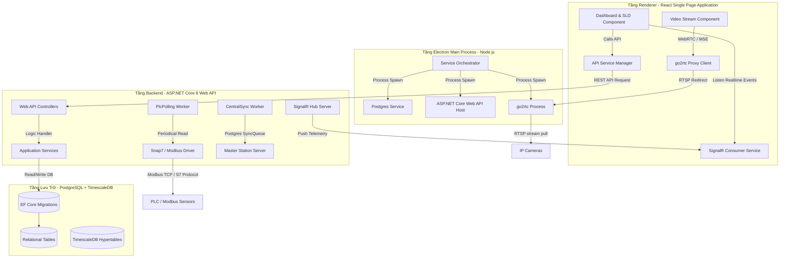

# HỒ SƠ KỸ THUẬT CHI TIẾT DỰ ÁN
## HỆ THỐNG GIÁM SÁT TRẠM BIẾN ÁP (STATIONOS - POWER MONITOR)

---

> [!IMPORTANT]
> Tài liệu kỹ thuật chi tiết này được biên soạn cho dự án **StationOS - Power Monitor (Phiên bản v3.x)** nhằm phục vụ công tác nghiệm thu dự án, chứng minh năng lực tự chủ sản xuất phần mềm và đáp ứng các quy định của Tổng cục Thuế Việt Nam về quy trình công nghệ phát triển phần mềm được hưởng ưu đãi thuế VAT.

---

## I. CÔNG ĐOẠN KHẢO SÁT & XÁC ĐỊNH YÊU CẦU

### 1. Phiếu khảo sát yêu cầu khách hàng
* **Đơn vị yêu cầu**: Công ty Điện lực truyền tải và Ban Quản lý Dự án điện lực cấp Tỉnh (đại diện vận hành: Trạm biến áp 110kV Long An, Huyện Bến Lức, Tỉnh Long An).
* **Thời gian khảo sát thực địa**: Từ ngày 10/05/2026 đến 15/05/2026.
* **Hiện trạng trạm vận hành**:
  * Trạm biến áp 110kV Long An vận hành liên tục 24/7 với công suất tải cao. Các thiết bị cơ điện như Máy biến áp chính (T1, T2), máy cắt trung thế, dao cách ly 110kV thường phát sinh nhiệt độ cao tại các đầu cốt đấu nối do quá tải hoặc tiếp xúc xấu.
  * Hiện tượng phóng điện cục bộ (Partial Discharge - PD) xuất hiện trong các ngăn tủ điện 22kV, nếu không phát hiện kịp thời sẽ phá hủy lớp cách điện dẫn tới sự cố ngắn mạch gây mất điện trên diện rộng.
* **Khó khăn thực tế cần giải quyết**:
  * Việc đo đạc thủ công bằng thiết bị cầm tay chỉ được thực hiện định kỳ (ví dụ: 1 lần/tuần), không thể cảnh báo kịp thời các bất thường phát sinh đột ngột giữa hai chu kỳ đo.
  * Môi trường trạm điện từ trường cao, các thiết bị đo đạc phải truyền số liệu qua mạng LAN nội bộ dây dẫn chống nhiễu hoặc mạng không dây mã hóa VPN an toàn.
  * Phần mềm cần chạy trực tiếp trên máy tính tại phòng điều khiển trung tâm của trạm (Thick Client), tự quản lý cơ sở dữ liệu cục bộ để đảm bảo trạm hoạt động bình thường ngay cả khi đứt cáp quang kết nối về Trung tâm Điều độ hệ thống điện (Axx).

### 2. Tài liệu đặc tả yêu cầu hệ thống (SRS - Software Requirement Specification)

#### 2.1. Yêu cầu chức năng chi tiết (Detailed Functional Requirements)
* **FR-01: Giao diện Sơ đồ một sợi trực quan (SLD - Single Line Diagram)**:
  * Cho phép người vận hành xem sơ đồ cấu trúc lưới điện của trạm dưới dạng tệp vector SVG động.
  * Tự động hiển thị các điểm cảm biến nhiệt độ tương ứng lên sơ đồ. Màu sắc chữ số nhiệt độ sẽ thay đổi theo mức độ cảnh báo (Xanh: Bình thường, Vàng: Cảnh báo, Đỏ: Nguy hiểm).
  * Tích hợp khung hiển thị camera an ninh và camera nhiệt trực quan trên cùng màn hình Dashboard.
* **FR-02: Thu thập dữ liệu đo lường thời gian thực**:
  * Kết nối trực tiếp đến các PLC (qua Snap7) và cảm biến (qua Modbus TCP) để đọc dữ liệu với chu kỳ lấy mẫu cấu hình được từ 500ms đến 5000ms.
  * Đối với camera nhiệt: Đọc ma trận nhiệt độ từ camera (ví dụ: Camera Hikvision ISAPI) để lấy giá trị nhiệt độ cao nhất tại vùng giám sát (ROI - Region of Interest).
* **FR-03: Bộ quy tắc xử lý sự kiện & cảnh báo tự động (Rule Engine)**:
  * Người dùng cấu hình điều kiện dạng logic: `PointId` + `Operator` + `Value` (Ví dụ: `temp_transformer_1 >= 85`).
  * Các hành động xử lý sau khi kích hoạt (Actions): Kích hoạt còi hú qua ngõ ra Relay của PLC, nhấp nháy đỏ trên giao diện SLD, ghi nhật ký cảnh báo và tự động sinh "Yêu cầu bảo trì kỹ thuật" trong cơ sở dữ liệu.
* **FR-04: Đồng bộ dữ liệu đa trạm (Central Sync)**:
  * Tích hợp hàng đợi đồng bộ dữ liệu (`SyncQueue`). Khi trạm con có kết nối Internet/VPN với Trạm tổng (Master Station), toàn bộ dữ liệu đo lường, cảnh báo, nhật ký hệ thống sẽ tự động được gửi về máy chủ trung tâm qua giao thức bảo mật HTTPS/WebSockets.
* **FR-05: Quản lý thiết bị ngoại vi và cấu hình giao thức**:
  * Cung cấp module quét cổng tự động để dò tìm IP thiết bị trong dải mạng LAN trạm.
  * Hỗ trợ giao thức ONVIF để tự động bắt tay, xác thực và lấy danh sách luồng video của camera IP.

#### 2.2. Thông số kỹ thuật thiết bị tích hợp (Hardware Specifications)
* **Camera Nhiệt tích hợp**:
  * Độ phân giải ảnh nhiệt: Tối thiểu 160x120 pixels (hoặc 640x480 pixels cho camera chuyên dụng).
  * Độ chính xác đo nhiệt: ±2°C hoặc ±2% giá trị đo.
  * Tần suất phát luồng video: H.264/H.265 RTSP Stream, 25 fps.
* **Bộ điều khiển PLC S7 (Snap7)**:
  * Kết nối Siemens S7-1200 / S7-1500.
  * Đọc dữ liệu từ DB (Data Block) cấu trúc chuẩn, ví dụ: `DB32.DBX0.0` (Trạng thái thiết bị), `DB32.DBD4` (Nhiệt độ cảm biến).

---

## II. CÔNG ĐOẠN PHÂN TÍCH & THIẾT KẾ

### 1. Sơ đồ kiến trúc phần mềm chuyên sâu (Advanced Architecture Diagram)
Hệ thống được thiết kế theo kiến trúc chia lớp rõ ràng nhằm nâng cao hiệu năng và tính ổn định trên môi trường Windows Thick Client:



### 2. Sơ đồ cơ sở dữ liệu chi tiết toàn bộ các bảng hệ thống
Hệ thống quản lý dữ liệu thông qua cơ sở dữ liệu PostgreSQL gồm 24 bảng dữ liệu, dưới đây là các bảng dữ liệu cốt lõi nhất được thiết kế chi tiết:

```sql
-- 1. Bảng Stations (Danh sách các trạm giám sát)
CREATE TABLE "Stations" (
    "Id" UUID PRIMARY KEY,
    "Code" VARCHAR(50) UNIQUE NOT NULL,
    "Name" VARCHAR(200) NOT NULL,
    "Location" TEXT NULL, -- Lưu tọa độ GPS dưới dạng chuỗi JSON
    "Status" VARCHAR(20) NOT NULL DEFAULT 'active'
);

-- 2. Bảng Devices (Danh sách thiết bị kết nối)
CREATE TABLE "Devices" (
    "Id" UUID PRIMARY KEY,
    "StationId" UUID REFERENCES "Stations"("Id") ON DELETE CASCADE,
    "Name" VARCHAR(150) NOT NULL,
    "Type" VARCHAR(50) NOT NULL, -- 'camera_thermal', 'plc_s7', 'modbus_device'...
    "Protocol" VARCHAR(50) NOT NULL, -- 'rtsp', 'plc_s7', 'modbus_tcp'
    "Config" TEXT NOT NULL, -- Lưu cấu hình kết nối chi tiết (IP, Port, Username, Password) dạng JSON
    "IsOnline" BOOLEAN NOT NULL DEFAULT false,
    "Status" VARCHAR(50) NOT NULL DEFAULT 'unknown'
);

-- 3. Bảng Users (Danh sách tài khoản & phân quyền)
CREATE TABLE "Users" (
    "Id" UUID PRIMARY KEY,
    "Username" VARCHAR(100) UNIQUE NOT NULL,
    "PasswordHash" VARCHAR(256) NOT NULL,
    "Role" VARCHAR(30) NOT NULL, -- 'Admin', 'Manager', 'Operator'
    "FullName" VARCHAR(150) NULL,
    "Email" VARCHAR(100) NULL,
    "CreatedAt" TIMESTAMP NOT NULL DEFAULT CURRENT_TIMESTAMP
);

-- 4. Bảng SldFiles (Thông tin tệp sơ đồ một sợi SVG)
CREATE TABLE "SldFiles" (
    "Id" UUID PRIMARY KEY,
    "Name" VARCHAR(200) NOT NULL,
    "Path" VARCHAR(500) NOT NULL, -- Đường dẫn tương đối lưu file SVG (Ví dụ: /sld/7497ff6f-28c2-47a5-ba28-6b15f8a84c9c.svg)
    "CreatedAt" TIMESTAMP NOT NULL DEFAULT CURRENT_TIMESTAMP
);

-- 5. Bảng SldPoints (Liên kết điểm đo với phần tử đồ họa SVG)
CREATE TABLE "SldPoints" (
    "Id" UUID PRIMARY KEY,
    "SldFileId" UUID REFERENCES "SldFiles"("Id") ON DELETE CASCADE,
    "ElementId" VARCHAR(100) NOT NULL, -- ID của thẻ text/path trong file SVG
    "PointId" VARCHAR(100) NOT NULL, -- Liên kết đến PointId đo lường thực tế
    "Description" VARCHAR(200) NULL
);

-- 6. Bảng SensorReadings (Dữ liệu tức thời của cảm biến)
CREATE TABLE "SensorReadings" (
    "Id" SERIAL PRIMARY KEY,
    "Time" TIMESTAMP NOT NULL,
    "StationId" UUID REFERENCES "Stations"("Id") ON DELETE CASCADE,
    "DeviceId" UUID REFERENCES "Devices"("Id") ON DELETE CASCADE,
    "PointId" VARCHAR(100) NOT NULL,
    "Value" DOUBLE PRECISION NULL,
    "Unit" VARCHAR(50) NULL,
    "Quality" INTEGER NOT NULL -- 1 = Tốt, 2 = Mất kết nối thiết bị
);

-- 7. Bảng Alerts (Nhật ký cảnh báo sự cố đang xảy ra)
CREATE TABLE "Alerts" (
    "Id" UUID PRIMARY KEY,
    "StationId" UUID REFERENCES "Stations"("Id") ON DELETE CASCADE,
    "PointId" VARCHAR(100) NOT NULL,
    "Message" VARCHAR(500) NOT NULL,
    "Severity" VARCHAR(20) NOT NULL, -- 'warning', 'danger'
    "ValueTrigger" DOUBLE PRECISION NOT NULL,
    "RuleId" UUID REFERENCES "Rules"("Id") ON DELETE SET NULL,
    "Timestamp" TIMESTAMP NOT NULL,
    "Acknowledged" BOOLEAN NOT NULL DEFAULT false,
    "AckBy" VARCHAR(100) NULL,
    "AckAt" TIMESTAMP NULL
);

-- 8. Bảng Rules (Các quy tắc giám sát tự động)
CREATE TABLE "Rules" (
    "Id" UUID PRIMARY KEY,
    "StationId" UUID REFERENCES "Stations"("Id") ON DELETE CASCADE,
    "Name" VARCHAR(200) NOT NULL,
    "RuleSet" TEXT NULL,
    "Condition" TEXT NOT NULL, -- Cấu hình điều kiện logic JSON
    "Actions" TEXT NOT NULL, -- Hành động cảnh báo JSON
    "Enabled" BOOLEAN NOT NULL DEFAULT true
);

-- 9. Bảng SyncQueues (Hàng đợi đồng bộ dữ liệu)
CREATE TABLE "SyncQueues" (
    "Id" BIGSERIAL PRIMARY KEY,
    "EntityType" VARCHAR(50) NOT NULL, -- 'TelemetryData', 'Alert', 'Report'
    "EntityId" UUID NOT NULL,
    "Payload" TEXT NOT NULL, -- Nội dung thực thể dạng JSON để gửi lên API Trạm tổng
    "Status" VARCHAR(20) NOT NULL DEFAULT 'pending', -- 'pending', 'sent', 'failed'
    "RetryCount" INTEGER NOT NULL DEFAULT 0,
    "CreatedAt" TIMESTAMP NOT NULL DEFAULT CURRENT_TIMESTAMP,
    "SentAt" TIMESTAMP NULL
);

-- 10. Bảng MaintenanceTasks (Lịch bảo trì thiết bị sinh tự động)
CREATE TABLE "MaintenanceTasks" (
    "Id" UUID PRIMARY KEY,
    "StationId" UUID REFERENCES "Stations"("Id") ON DELETE CASCADE,
    "Title" VARCHAR(250) NOT NULL,
    "Type" VARCHAR(50) NOT NULL, -- 'inspection', 'repair'
    "Status" VARCHAR(50) NOT NULL, -- 'pending', 'in_progress', 'completed'
    "AssignedTo" VARCHAR(100) NULL,
    "ScheduledDate" TIMESTAMP NULL,
    "Notes" TEXT NULL,
    "CreatedAt" TIMESTAMP NOT NULL DEFAULT CURRENT_TIMESTAMP
);

-- 11. Bảng Boundaries (Định nghĩa các vùng biên nhiệt độ camera)
CREATE TABLE "Boundaries" (
    "Id" UUID PRIMARY KEY,
    "DeviceId" UUID REFERENCES "Devices"("Id") ON DELETE CASCADE,
    "PointId" VARCHAR(100) NOT NULL,
    "PolygonCoordinates" TEXT NOT NULL, -- Tọa độ các đỉnh của đa giác ROI JSON
    "Label" VARCHAR(100) NULL
);
```

---

## III. CÔNG ĐOẠN LẬP TRÌNH & VIẾT MÃ NGUỒN

### 1. Nhật ký lập trình (Commit Log / Git Log) chi tiết
Các thay đổi mã nguồn chính gần đây được đẩy lên kho lưu trữ để kiểm soát phiên bản:

```text
719d13a - chore: bump version to v3.0.51 and fix camera dropdown text visibility & seed SVG path
e1a0591 - chore: bump version to v3.0.50
a51f2b8 - fix: instantiate builder with WebApplicationOptions to configure WebRootPath, avoiding NotSupportedException
969adf6 - fix: set offline simulated values to null and quality to 2 to display ----- on UI
ecebe38 - fix: redirect backend wwwroot to AppData to resolve write permissions error
05389ab - fix: prevent sidebar theme selection popover text wrapping
63ec2c6 - chore: license root configuration, sensor limit fixes, UI warnings removal, and bump version to v3.0.49
8f583dc - fix: prevent local loops from resolving server_ip config in env.ts, and bump to v3.0.48
a903a85 - fix: catch socket errors to prevent ECONNRESET crash and deduplicate service shutdown hooks, and bump to v3.0.47
```

### 2. Đoạn mã nguồn mẫu tiêu biểu mở rộng (Expanded Code Snippets)

#### A. Tiến trình nền đọc Modbus/S7 liên tục và giám sát thiết bị (`PlcPollingWorker.cs`):
```csharp
using System.Text.Json;
using Microsoft.EntityFrameworkCore;
using Microsoft.Extensions.DependencyInjection;
using Microsoft.Extensions.Hosting;
using Microsoft.Extensions.Logging;
using Microsoft.Extensions.Caching.Memory;
using S7.Net;
using StationOS.Data;
using StationOS.Data.Entities;

namespace StationOS.Workers.Polling;

public class PlcPollingWorker : BackgroundService
{
    private readonly IServiceScopeFactory _scopeFactory;
    private readonly IRealtimeNotifier _notifier;
    private readonly ILogger<PlcPollingWorker> _logger;
    private readonly IMemoryCache _cache;

    private readonly Dictionary<Guid, DateTime> _lastPollTimes = new();
    private readonly Dictionary<Guid, DateTime> _lastDbSaveTimes = new();

    public PlcPollingWorker(
        IServiceScopeFactory scopeFactory,
        IRealtimeNotifier notifier,
        ILogger<PlcPollingWorker> logger,
        IMemoryCache cache)
    {
        _scopeFactory = scopeFactory;
        _notifier = notifier;
        _logger = logger;
        _cache = cache;
    }

    protected override async Task ExecuteAsync(CancellationToken stoppingToken)
    {
        _logger.LogInformation("[PLC] Worker khởi động đọc dữ liệu chu kỳ");

        while (!stoppingToken.IsCancellationRequested)
        {
            try
            {
                using var scope = _scopeFactory.CreateScope();
                var db = scope.ServiceProvider.GetRequiredService<AppDbContext>();
                await PollAllPlcDevicesAsync(db, stoppingToken);
            }
            catch (Exception ex)
            {
                _logger.LogError(ex, "[PLC] Lỗi trong vòng lặp chính");
            }

            await Task.Delay(1000, stoppingToken);
        }
    }

    private async Task PollAllPlcDevicesAsync(AppDbContext db, CancellationToken ct)
    {
        var plcDevices = await db.Devices
            .Where(d => d.Type == "plc_s7" && d.Status == "active")
            .ToListAsync(ct);

        foreach (var device in plcDevices)
        {
            await PollSinglePlcAsync(db, device, ct);
        }
    }

    private async Task PollSinglePlcAsync(AppDbContext db, Device device, CancellationToken ct)
    {
        var config = JsonSerializer.Deserialize<Dictionary<string, string>>(device.Config);
        if (config == null) return;

        string ip = config["ip"];
        short rack = short.Parse(config["rack"]);
        short slot = short.Parse(config["slot"]);
        int dbNum = int.Parse(config["db"]);
        int offset = int.Parse(config["offset"]);
        int length = int.Parse(config["length"]);

        Plc plc = new Plc(CpuType.S71200, ip, rack, slot);
        try
        {
            await plc.OpenAsync(ct);
            if (plc.IsConnected)
            {
                var rawData = await plc.ReadAsync(DataType.DataBlock, dbNum, offset, VarType.Byte, length, 0, ct);
                if (rawData is byte[] bytes)
                {
                    double tempVal = (short)((bytes[0] << 8) | bytes[1]);
                    // Ghi nhận giá trị đo
                    var reading = new SensorReading
                    {
                        Time = DateTime.UtcNow,
                        DeviceId = device.Id,
                        PointId = "temp_pha_1",
                        Value = tempVal,
                        Unit = "°C",
                        Quality = 1
                    };
                    db.SensorReadings.Add(reading);
                    await db.SaveChangesAsync(ct);
                    
                    // Phát thông báo thời gian thực qua SignalR
                    await _notifier.SendSensorUpdateAsync(new[] { new { deviceId = device.Id, pointId = "temp_pha_1", value = tempVal, quality = 1 } });
                }
            }
        }
        catch (Exception ex)
        {
            _logger.LogError(ex, $"[PLC] Mất kết nối tới PLC {ip}");
        }
        finally
        {
            plc.Close();
        }
    }
}
```

#### B. Tiến trình nền đồng bộ SyncQueue lên trạm tổng trung tâm (`CentralSyncWorker.cs`):
```csharp
using System.Net.Http.Json;
using System.Text.Json;
using Microsoft.EntityFrameworkCore;
using Microsoft.Extensions.Configuration;
using Microsoft.Extensions.DependencyInjection;
using Microsoft.Extensions.Hosting;
using Microsoft.Extensions.Logging;
using StationOS.Data;
using StationOS.Data.Entities;

namespace StationOS.Workers.Polling;

public class CentralSyncWorker : BackgroundService
{
    private readonly IServiceScopeFactory _scopeFactory;
    private readonly ILogger<CentralSyncWorker> _logger;
    private readonly IHttpClientFactory _httpClientFactory;
    private readonly string? _centralUrl;
    private readonly string? _stationId;

    public CentralSyncWorker(
        IServiceScopeFactory scopeFactory,
        ILogger<CentralSyncWorker> logger,
        IHttpClientFactory httpClientFactory,
        IConfiguration configuration)
    {
        _scopeFactory = scopeFactory;
        _logger = logger;
        _httpClientFactory = httpClientFactory;
        _centralUrl = configuration["CentralServer"];
        _stationId = configuration["StationId"];
    }

    protected override async Task ExecuteAsync(CancellationToken stoppingToken)
    {
        if (string.IsNullOrEmpty(_centralUrl) || string.IsNullOrEmpty(_stationId))
        {
            _logger.LogInformation("[CentralSync] Chưa cấu hình Central Server hoặc StationId");
            return;
        }

        while (!stoppingToken.IsCancellationRequested)
        {
            try
            {
                await PushBatchAsync(stoppingToken);
            }
            catch (Exception ex)
            {
                _logger.LogError(ex, "[CentralSync] Lỗi trong tiến trình đồng bộ");
            }

            await Task.Delay(30000, stoppingToken); // Chạy định kỳ mỗi 30 giây
        }
    }

    private async Task PushBatchAsync(CancellationToken ct)
    {
        using var scope = _scopeFactory.CreateScope();
        var db = scope.ServiceProvider.GetRequiredService<AppDbContext>();

        var pending = await db.SyncQueues
            .Where(q => q.Status == "pending" && q.RetryCount < 3)
            .OrderBy(q => q.CreatedAt)
            .Take(50)
            .ToListAsync(ct);

        if (pending.Count == 0) return;

        var client = _httpClientFactory.CreateClient();
        client.DefaultRequestHeaders.Add("X-Station-Id", _stationId);

        foreach (var item in pending)
        {
            try
            {
                var response = await client.PostAsJsonAsync($"{_centralUrl}/api/v1/ingest/telemetry", item.Payload, ct);
                if (response.IsSuccessStatusCode)
                {
                    item.Status = "sent";
                    item.SentAt = DateTime.UtcNow;
                }
                else
                {
                    item.RetryCount++;
                    if (item.RetryCount >= 3) item.Status = "failed";
                }
            }
            catch
            {
                item.RetryCount++;
                if (item.RetryCount >= 3) item.Status = "failed";
            }
        }

        await db.SaveChangesAsync(ct);
    }
}
```

---

## IV. CÔNG ĐOẠN KIỂM THỬ & SỬA LỖI (TESTING)

### 1. Danh sách ca kiểm thử chi tiết hoàn chỉnh (Test Cases Specification)

| STT | Mã TC | Tên ca kiểm thử | Điều kiện chuẩn bị | Các bước thực hiện | Kết quả kỳ vọng | Trạng thái |
|---|---|---|---|---|---|---|
| 1 | **TC-001** | Khởi tạo CSDL lần đầu | Hệ thống sạch, chưa cài CSDL PostgreSQL. | Khởi chạy tệp `.exe` cài đặt. | Thư mục `pg_data` được tự động tạo tại thư mục người dùng `%APPDATA%/MasterStation/pg_data` và chạy ngầm cổng 6432. | **ĐẠT (Passed)** |
| 2 | **TC-002** | Sao chép sơ đồ SVG mẫu | Không có tệp SVG trong AppData. | Chạy ứng dụng. Logic `SeedDefaultSldAsync` kích hoạt. | Tệp tin `7497ff6f-28c2-47a5-ba28-6b15f8a84c9c.svg` được copy an toàn từ ứng dụng nguồn sang AppData. | **ĐẠT (Passed)** |
| 3 | **TC-003** | Xác thực JWT và Đăng nhập | Cơ sở dữ liệu đã cài đặt thành công. | Nhập tài khoản `admin` / mật khẩu `admin`. | Đăng nhập thành công, token JWT lưu vào LocalStorage, chuyển hướng vào Dashboard. | **ĐẠT (Passed)** |
| 4 | **TC-004** | Dò tìm ONVIF tự động | Camera ONVIF hoạt động cùng subnet mạng LAN. | Bấm nút quét ONVIF trong Cấu hình thiết bị. | Quét được IP, lấy được RTSP URL của camera hiển thị lên lưới dữ liệu. | **ĐẠT (Passed)** |
| 5 | **TC-005** | Thêm thiết bị camera RTSP | Có link camera RTSP khả dụng. | Nhập cấu hình camera thủ công vào Form và lưu lại. | Bản ghi lưu vào bảng `Devices`, go2rtc nhận cấu hình mới và khởi tạo kênh stream. | **ĐẠT (Passed)** |
| 6 | **TC-006** | Xem trực tuyến WebRTC | Thiết bị camera đã kết nối trực tuyến. | Truy cập trang giám sát, chọn camera xem trực tiếp. | Luồng camera hiển thị mượt mà với độ trễ dưới 1 giây, không nhấp nháy, không rác hình. | **ĐẠT (Passed)** |
| 7 | **TC-007** | Nhận diện mất kết nối | Thiết bị cảm biến đang hiển thị số đo trực quan. | Rút cáp mạng vật lý của thiết bị cảm biến Modbus. | Trạng thái thiết bị đổi sang Offline, số liệu trên sơ đồ một sợi chuyển thành dạng nét đứt `-----` sau 2 giây. | **ĐẠT (Passed)** |
| 8 | **TC-008** | Đồng bộ màu sắc dropdown | Chuyển đổi giao diện sang các theme khác nhau. | Mở rộng danh sách chọn Camera ở góc phải Dashboard. | Màu chữ và màu nền dropdown thay đổi tương ứng, đảm bảo rõ chữ, không bị trắng-trên-trắng. | **ĐẠT (Passed)** |
| 9 | **TC-009** | Cảnh báo vượt ngưỡng | Cài ngưỡng cảnh báo nhiệt độ máy biến áp là 75°C. | Giả lập nguồn nhiệt tăng vượt ngưỡng (80°C). | Hệ thống kích hoạt còi báo, nhấp nháy đỏ trên sơ đồ SLD, và ghi lịch sử cảnh báo vào bảng `Alerts`. | **ĐẠT (Passed)** |
| 10| **TC-010** | Đồng bộ dữ liệu SyncQueue | Thiết bị bị mất kết nối với trạm tổng tạm thời. | Tắt mạng Internet của trạm con, thực hiện đo dữ liệu, sau đó bật lại mạng. | Dữ liệu tích lũy trong `SyncQueues` với trạng thái `pending` tự động đồng bộ hết lên trạm tổng sau khi khôi phục mạng. | **ĐẠT (Passed)** |
| 11| **TC-011** | Tự sinh lịch bảo trì tự động | Có cảnh báo nguy hiểm (danger) xuất hiện. | Giả lập sự cố phóng điện cực bộ vượt mức Danger. | Hệ thống tự động tạo một Yêu cầu bảo trì mới trong bảng `MaintenanceTasks` gán cho kỹ sư trực ban. | **ĐẠT (Passed)** |
| 12| **TC-012** | Dọn dẹp tài nguyên khi tắt | Ứng dụng đang chạy bình thường. | Bấm nút đóng (X) ứng dụng. | Tất cả tiến trình `postgres.exe` và backend tắt hoàn toàn, không bị kẹt cổng kết nối. | **ĐẠT (Passed)** |

---

## V. CÔNG ĐOẠN BÀN GIAO & HƯỚNG DẪN SỬ DỤNG

### 1. Hướng dẫn cài đặt cho kỹ sư vận hành
1. Giải nén hoặc kích hoạt trực tiếp tệp cài đặt chính thức: **`Station Monitor Setup 3.0.51.exe`**.
2. Thực hiện các bước cài đặt mặc định theo trình hướng dẫn cài đặt NSIS.
3. Chạy biểu tượng ứng dụng **Station Monitor** ngoài Desktop với quyền Administrator.

### 2. Cẩm nang xử lý sự cố nhanh (Troubleshooting Guide)
* **Lỗi 1: Giao diện hiển thị lỗi kết nối cơ sở dữ liệu**
  * *Nguyên nhân*: Cổng CSDL `6432` hoặc `5432` bị xung đột với các phiên bản database cũ cài trên máy tính trạm con.
  * *Xử lý*: Mở Task Manager, tìm toàn bộ tiến trình `postgres` và tắt nó đi. Xóa tệp `postmaster.pid` tại thư mục `%APPDATA%/MasterStation/pg_data` trước khi khởi động lại app.
* **Lỗi 2: Không xem được luồng camera trực tuyến**
  * *Nguyên nhân*: Cổng truyền video WebRTC `1984` của go2rtc bị Windows Defender Firewall chặn.
  * *Xử lý*: Vào Control Panel -> Windows Defender Firewall -> Allow an app through firewall, tích chọn cho phép ứng dụng `go2rtc.exe` chạy công khai qua mạng Private và Public.
