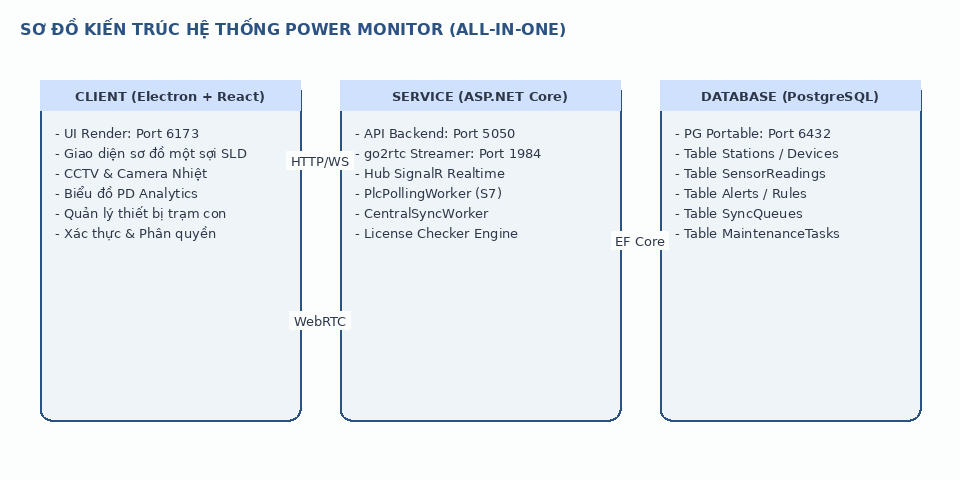
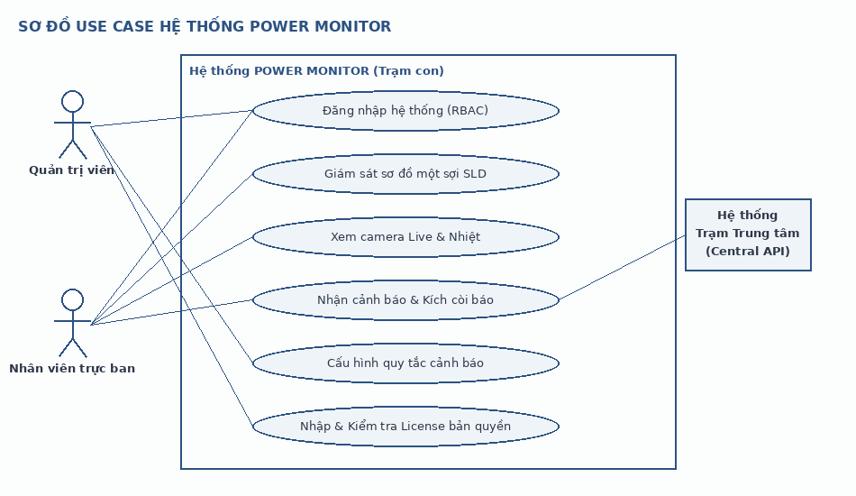
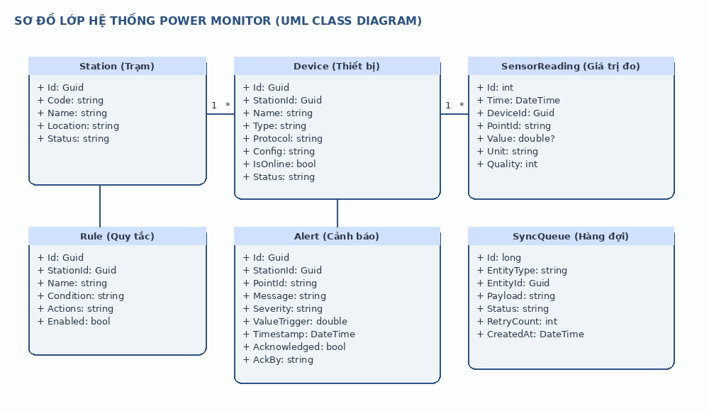
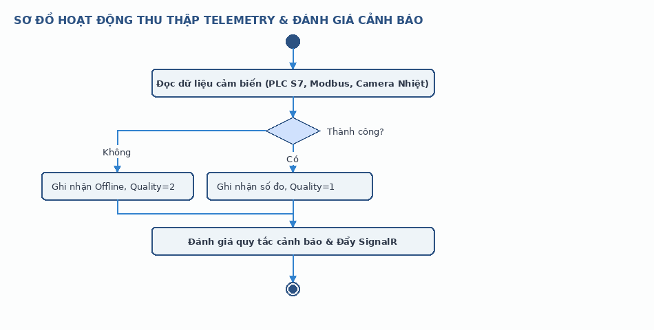
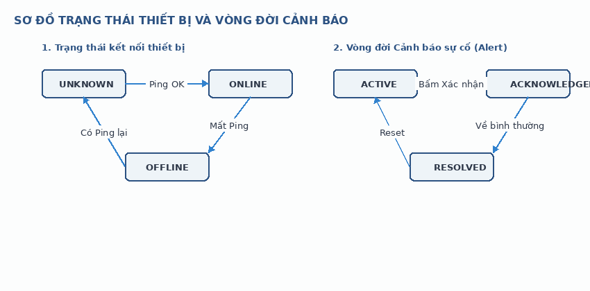
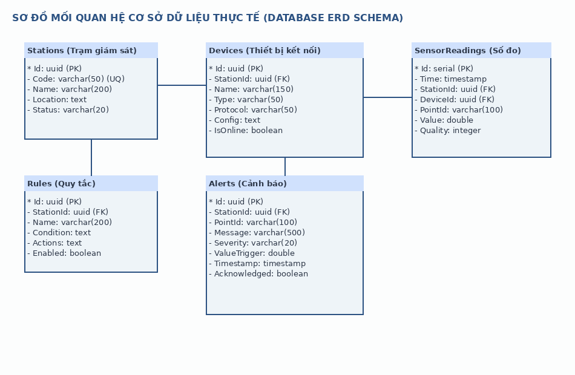

# HỒ SƠ KỸ THUẬT CHI TIẾT DỰ ÁN
## HỆ THỐNG GIÁM SÁT TRẠM BIẾN ÁP (POWER MONITOR)

---

> [!IMPORTANT]
> Tài liệu kỹ thuật chi tiết này được biên soạn cho dự án **POWER MONITOR (Phiên bản v3.x)** nhằm phục vụ công tác nghiệm thu bàn giao và chứng minh quy trình công nghệ phát triển phần mềm độc lập để hưởng các chính sách ưu đãi thuế VAT của Bộ Tài chính/Tổng cục Thuế Việt Nam.

---

## I. CÔNG ĐOẠN KHẢO SÁT & XÁC ĐỊNH YÊU CẦU

### 1. Phiếu khảo sát yêu cầu khách hàng
* **Đơn vị yêu cầu**: Công ty Điện lực truyền tải và Ban Quản lý Dự án điện lực cấp Tỉnh (đại diện vận hành: Trạm biến áp 110kV Long An, Huyện Bến Lức, Tỉnh Long An).
* **Thời gian khảo sát thực địa**: Từ ngày 10/05/2026 đến 15/05/2026.
* **Hiện trạng trạm vận hành**:
  * Trạm biến áp 110kV Long An vận hành liên tục 24/7 với công suất tải cao. Các thiết bị cơ điện như Máy biến áp chính (T1, T2), máy cắt trung thế, dao cách ly 110kV thường phát sinh nhiệt độ cao tại các đầu cốt đấu nối do quá tải hoặc tiếp xúc xấu.
  * Hiện tượng phóng điện cục bộ (Partial Discharge - PD) xuất hiện trong các ngăn tủ điện 22kV, nếu không phát hiện kịp thời sẽ phá hủy lớp cách điện dẫn tới sự cố ngắn mạch gây mất điện trên diện rộng.
* **Khó khăn thực tế cần giải quyết**:
  * Việc đo đạc thủ công bằng thiết bị cầm tay chỉ được thực hiện định kỳ (ví dụ: 1 lần/tuần), không thể cảnh báo kịp thời các bất thường phát sinh đột ngột giữa hai chu kỳ đo.
  * Môi trường trạm điện từ trường cao, các thiết bị đo đạc phải truyền số liệu qua mạng LAN nội bộ dây dẫn chống nhiễu hoặc mạng không dây mã hóa VPN an toàn.
  * Phần mềm cần chạy trực tiếp trên máy tính tại phòng điều khiển trung tâm của trạm (Thick Client), tự quản lý cơ sở dữ liệu cục bộ để đảm bảo trạm hoạt động bình thường ngay cả khi đứt cáp quang kết nối về Trung tâm Điều độ hệ thống điện (Axx).

### 2. Tài liệu đặc tả yêu cầu hệ thống (SRS)

#### 2.1. Yêu cầu chức năng chi tiết
* **FR-01: Giao diện Sơ đồ một sợi trực quan (SLD)**:
  * Cho phép người vận hành xem sơ đồ cấu trúc lưới điện của trạm dưới dạng tệp vector SVG động.
  * Tự động hiển thị các điểm cảm biến nhiệt độ tương ứng lên sơ đồ. Màu sắc chữ số nhiệt độ sẽ thay đổi theo mức độ cảnh báo (Xanh: Bình thường, Vàng: Cảnh báo, Đỏ: Nguy hiểm).
  * Tích hợp khung hiển thị camera an ninh và camera nhiệt trực quan trên cùng màn hình Dashboard.
* **FR-02: Thu thập dữ liệu đo lường thời gian thực**:
  * Kết nối trực tiếp đến các PLC (qua Snap7) và cảm biến (qua Modbus TCP) để đọc dữ liệu với chu kỳ lấy mẫu cấu hình được từ 500ms đến 5000ms.
  * Đối với camera nhiệt: Đọc ma trận nhiệt độ từ camera (ví dụ: Camera Hikvision ISAPI) để lấy giá trị nhiệt độ cao nhất tại vùng giám sát (ROI - Region of Interest).
* **FR-03: Bộ quy tắc xử lý sự kiện & cảnh báo tự động (Rule Engine)**:
  * Người dùng cấu hình điều kiện dạng logic: `PointId` + `Operator` + `Value` (Ví dụ: `temp_transformer_1 >= 85`).
  * Các hành động xử lý sau khi kích hoạt (Actions): Kích hoạt còi hú qua ngõ ra Relay của PLC, nhấp nháy đỏ trên giao diện SLD, ghi nhật ký cảnh báo và tự động sinh "Yêu cầu bảo trì kỹ thuật" trong cơ sở dữ liệu.
* **FR-04: Đồng bộ dữ liệu đa trạm (Central Sync)**:
  * Tích hợp hàng đợi đồng bộ dữ liệu (`SyncQueue`). Khi trạm con có kết nối Internet/VPN với Trạm trung tâm (Master Station), toàn bộ dữ liệu đo lường, cảnh báo, nhật ký hệ thống sẽ tự động được gửi về máy chủ trung tâm qua giao thức bảo mật HTTPS/WebSockets.
* **FR-05: Quản lý thiết bị ngoại vi và cấu hình giao thức**:
  * Cung cấp module quét cổng tự động để dò tìm IP thiết bị trong dải mạng LAN trạm.
  * Hỗ trợ giao thức ONVIF để tự động bắt tay, xác thực và lấy danh sách luồng video của camera IP.

#### 2.2. Thông số kỹ thuật thiết bị tích hợp
* **Camera Nhiệt tích hợp**:
  * Độ phân giải ảnh nhiệt: Tối thiểu 160x120 pixels.
  * Độ chính xác đo nhiệt: ±2°C hoặc ±2% giá trị đo.
  * Tần suất phát luồng video: H.264/H.265 RTSP Stream, 25 fps.
* **Bộ điều khiển PLC S7 (Snap7)**:
  * Kết nối Siemens S7-1200 / S7-1500.
  * Đọc dữ liệu từ DB (Data Block) cấu trúc chuẩn, ví dụ: `DB32.DBX0.0` (Trạng thái thiết bị), `DB32.DBD4` (Nhiệt độ cảm biến).

---

## II. CÔNG ĐOẠN PHÂN TÍCH & THIẾT KẾ

### 1. Sơ đồ kiến trúc hệ thống (System Architecture Diagram)


### 2. Sơ đồ Use Case (Use Case Diagram)


### 3. Sơ đồ Lớp (Class Diagram)


### 4. Sơ đồ Hoạt động (Activity Diagram)


### 5. Sơ đồ Trạng thái (State Diagram)


### 6. Sơ đồ cơ sở dữ liệu chi tiết toàn bộ các bảng hệ thống


Hệ thống quản lý dữ liệu thông qua cơ sở dữ liệu PostgreSQL gồm các bảng dữ liệu cốt lõi dưới đây:

#### 6.1 Bảng `Stations` (Danh sách các trạm giám sát)
```sql
CREATE TABLE "Stations" (
    "Id" UUID PRIMARY KEY,
    "Code" VARCHAR(50) UNIQUE NOT NULL,
    "Name" VARCHAR(200) NOT NULL,
    "Location" TEXT NULL,
    "Status" VARCHAR(20) NOT NULL DEFAULT 'active'
);
```
| Tên trường | Kiểu dữ liệu | Khóa | Ràng buộc | Mô tả |
|---|---|---|---|---|
| `Id` | `UUID` | PK | NOT NULL | Khóa chính tự sinh |
| `Code` | `VARCHAR(50)` | - | UNIQUE, NOT NULL | Mã định danh trạm (VD: TBA_LA_01) |
| `Name` | `VARCHAR(200)` | - | NOT NULL | Tên trạm biến áp |
| `Location` | `TEXT` | - | NULL | Chuỗi JSON chứa kinh độ, vĩ độ |
| `Status` | `VARCHAR(20)` | - | NOT NULL | Trạng thái trạm (`active`/`inactive`) |

#### 6.2 Bảng `Devices` (Danh sách thiết bị kết nối)
```sql
CREATE TABLE "Devices" (
    "Id" UUID PRIMARY KEY,
    "StationId" UUID REFERENCES "Stations"("Id") ON DELETE CASCADE,
    "Name" VARCHAR(150) NOT NULL,
    "Type" VARCHAR(50) NOT NULL,
    "Protocol" VARCHAR(50) NOT NULL,
    "Config" TEXT NOT NULL,
    "IsOnline" BOOLEAN NOT NULL DEFAULT false,
    "Status" VARCHAR(50) NOT NULL DEFAULT 'unknown'
);
```
| Tên trường | Kiểu dữ liệu | Khóa | Ràng buộc | Mô tả |
|---|---|---|---|---|
| `Id` | `UUID` | PK | NOT NULL | Khóa chính thiết bị |
| `StationId` | `UUID` | FK | REFERENCES Stations | Trạm biến áp chứa thiết bị này |
| `Name` | `VARCHAR(150)` | - | NOT NULL | Tên thiết bị |
| `Type` | `VARCHAR(50)` | - | NOT NULL | Loại (`plc_s7`, `camera_thermal`, `modbus`) |
| `Protocol` | `VARCHAR(50)` | - | NOT NULL | Giao thức (`snap7`, `rtsp`, `modbus_tcp`) |
| `Config` | `TEXT` | - | NOT NULL | Chuỗi cấu hình JSON (IP, port, database...) |
| `IsOnline` | `BOOLEAN` | - | NOT NULL | Trạng thái kết nối |
| `Status` | `VARCHAR(50)` | - | NOT NULL | Trạng thái hoạt động |

#### 6.3 Bảng `Users` (Danh sách tài khoản & phân quyền)
```sql
CREATE TABLE "Users" (
    "Id" UUID PRIMARY KEY,
    "Username" VARCHAR(100) UNIQUE NOT NULL,
    "PasswordHash" VARCHAR(256) NOT NULL,
    "Role" VARCHAR(30) NOT NULL,
    "FullName" VARCHAR(150) NULL,
    "Email" VARCHAR(100) NULL,
    "CreatedAt" TIMESTAMP NOT NULL DEFAULT CURRENT_TIMESTAMP
);
```
| Tên trường | Kiểu dữ liệu | Khóa | Ràng buộc | Mô tả |
|---|---|---|---|---|
| `Id` | `UUID` | PK | NOT NULL | Khóa chính người dùng |
| `Username` | `VARCHAR(100)` | - | UNIQUE, NOT NULL | Tên đăng nhập |
| `PasswordHash` | `VARCHAR(256)` | - | NOT NULL | Mật khẩu băm an toàn |
| `Role` | `VARCHAR(30)` | - | NOT NULL | Vai trò phân quyền (`Admin`, `Manager`, `Operator`) |
| `FullName` | `VARCHAR(150)` | - | NULL | Họ và tên đầy đủ |
| `Email` | `VARCHAR(100)` | - | NULL | Hòm thư điện tử |
| `CreatedAt` | `TIMESTAMP` | - | NOT NULL | Ngày tạo tài khoản |

#### 6.4 Bảng `SldFiles` (Thông tin tệp sơ đồ một sợi SVG)
```sql
CREATE TABLE "SldFiles" (
    "Id" UUID PRIMARY KEY,
    "Name" VARCHAR(200) NOT NULL,
    "Path" VARCHAR(500) NOT NULL,
    "CreatedAt" TIMESTAMP NOT NULL DEFAULT CURRENT_TIMESTAMP
);
```
| Tên trường | Kiểu dữ liệu | Khóa | Ràng buộc | Mô tả |
|---|---|---|---|---|
| `Id` | `UUID` | PK | NOT NULL | Khóa chính sơ đồ |
| `Name` | `VARCHAR(200)` | - | NOT NULL | Tên bản vẽ sơ đồ |
| `Path` | `VARCHAR(500)` | - | NOT NULL | Đường dẫn lưu trữ tệp SVG trên đĩa |
| `CreatedAt` | `TIMESTAMP` | - | NOT NULL | Thời điểm tải lên |

#### 6.5 Bảng `SldPoints` (Liên kết điểm đo với phần tử đồ họa SVG)
```sql
CREATE TABLE "SldPoints" (
    "Id" UUID PRIMARY KEY,
    "SldFileId" UUID REFERENCES "SldFiles"("Id") ON DELETE CASCADE,
    "ElementId" VARCHAR(100) NOT NULL,
    "PointId" VARCHAR(100) NOT NULL,
    "Description" VARCHAR(200) NULL
);
```
| Tên trường | Kiểu dữ liệu | Khóa | Ràng buộc | Mô tả |
|---|---|---|---|---|
| `Id` | `UUID` | PK | NOT NULL | Khóa chính liên kết |
| `SldFileId` | `UUID` | FK | REFERENCES SldFiles | Sơ đồ một sợi áp dụng |
| `ElementId` | `VARCHAR(100)` | - | NOT NULL | ID thẻ DOM trong mã nguồn SVG |
| `PointId` | `VARCHAR(100)` | - | NOT NULL | Mã điểm đo cảm biến |
| `Description` | `VARCHAR(200)` | - | NULL | Chú thích điểm liên kết |

#### 6.6 Bảng `SensorReadings` (Dữ liệu tức thời của cảm biến)
```sql
CREATE TABLE "SensorReadings" (
    "Id" SERIAL PRIMARY KEY,
    "Time" TIMESTAMP NOT NULL,
    "StationId" UUID REFERENCES "Stations"("Id") ON DELETE CASCADE,
    "DeviceId" UUID REFERENCES "Devices"("Id") ON DELETE CASCADE,
    "PointId" VARCHAR(100) NOT NULL,
    "Value" DOUBLE PRECISION NULL,
    "Unit" VARCHAR(50) NULL,
    "Quality" INTEGER NOT NULL
);
```
| Tên trường | Kiểu dữ liệu | Khóa | Ràng buộc | Mô tả |
|---|---|---|---|---|
| `Id` | `SERIAL` | PK | NOT NULL | Khóa tăng tự động |
| `Time` | `TIMESTAMP` | - | NOT NULL | Thời gian lấy mẫu dữ liệu |
| `StationId` | `UUID` | FK | REFERENCES Stations | Trạm biến áp đo được |
| `DeviceId` | `UUID` | FK | REFERENCES Devices | Thiết bị thực hiện phép đo |
| `PointId` | `VARCHAR(100)` | - | NOT NULL | Mã điểm đo (VD: `temp_pha_1`) |
| `Value` | `DOUBLE PRECISION`| - | NULL | Giá trị số thực đo được |
| `Unit` | `VARCHAR(50)` | - | NULL | Đơn vị đo (`°C`, `dB`...) |
| `Quality` | `INTEGER` | - | NOT NULL | Chất lượng tín hiệu (`1`=Tốt, `2`=Mất kết nối) |

#### 6.7 Bảng `Alerts` (Nhật ký cảnh báo sự cố đang xảy ra)
```sql
CREATE TABLE "Alerts" (
    "Id" UUID PRIMARY KEY,
    "StationId" UUID REFERENCES "Stations"("Id") ON DELETE CASCADE,
    "PointId" VARCHAR(100) NOT NULL,
    "Message" VARCHAR(500) NOT NULL,
    "Severity" VARCHAR(20) NOT NULL,
    "ValueTrigger" DOUBLE PRECISION NOT NULL,
    "RuleId" UUID REFERENCES "Rules"("Id") ON DELETE SET NULL,
    "Timestamp" TIMESTAMP NOT NULL,
    "Acknowledged" BOOLEAN NOT NULL DEFAULT false,
    "AckBy" VARCHAR(100) NULL,
    "AckAt" TIMESTAMP NULL
);
```
| Tên trường | Kiểu dữ liệu | Khóa | Ràng buộc | Mô tả |
|---|---|---|---|---|
| `Id` | `UUID` | PK | NOT NULL | Khóa chính cảnh báo |
| `StationId` | `UUID` | FK | REFERENCES Stations | Trạm xảy ra cảnh báo |
| `PointId` | `VARCHAR(100)` | - | NOT NULL | Điểm đo vượt ngưỡng |
| `Message` | `VARCHAR(500)` | - | NOT NULL | Nội dung cảnh báo |
| `Severity` | `VARCHAR(20)` | - | NOT NULL | Mức độ nguy hiểm (`warning`/`danger`) |
| `ValueTrigger` | `DOUBLE` | - | NOT NULL | Giá trị kích hoạt cảnh báo |
| `RuleId` | `UUID` | FK | REFERENCES Rules | Quy tắc được cấu hình áp dụng |
| `Timestamp` | `TIMESTAMP` | - | NOT NULL | Thời gian xuất hiện sự cố |
| `Acknowledged` | `BOOLEAN` | - | NOT NULL | Đã xác nhận cảnh báo chưa |

#### 6.8 Bảng `Rules` (Các quy tắc giám sát tự động)
```sql
CREATE TABLE "Rules" (
    "Id" UUID PRIMARY KEY,
    "StationId" UUID REFERENCES "Stations"("Id") ON DELETE CASCADE,
    "Name" VARCHAR(200) NOT NULL,
    "RuleSet" TEXT NULL,
    "Condition" TEXT NOT NULL,
    "Actions" TEXT NOT NULL,
    "Enabled" BOOLEAN NOT NULL DEFAULT true
);
```
| Tên trường | Kiểu dữ liệu | Khóa | Ràng buộc | Mô tả |
|---|---|---|---|---|
| `Id` | `UUID` | PK | NOT NULL | Khóa chính luật |
| `StationId` | `UUID` | FK | REFERENCES Stations | Trạm áp dụng luật |
| `Name` | `VARCHAR(200)` | - | NOT NULL | Tên quy tắc giám sát |
| `Condition` | `TEXT` | - | NOT NULL | Biểu thức điều kiện logic dạng JSON |
| `Actions` | `TEXT` | - | NOT NULL | Biểu thức hành động xử lý dạng JSON |
| `Enabled` | `BOOLEAN` | - | NOT NULL | Quy tắc đang bật hay tắt |

#### 6.9 Bảng `SyncQueues` (Hàng đợi đồng bộ dữ liệu)
```sql
CREATE TABLE "SyncQueues" (
    "Id" BIGSERIAL PRIMARY KEY,
    "EntityType" VARCHAR(50) NOT NULL,
    "EntityId" UUID NOT NULL,
    "Payload" TEXT NOT NULL,
    "Status" VARCHAR(20) NOT NULL DEFAULT 'pending',
    "RetryCount" INTEGER NOT NULL DEFAULT 0,
    "CreatedAt" TIMESTAMP NOT NULL DEFAULT CURRENT_TIMESTAMP,
    "SentAt" TIMESTAMP NULL
);
```
| Tên trường | Kiểu dữ liệu | Khóa | Ràng buộc | Mô tả |
|---|---|---|---|---|
| `Id` | `BIGSERIAL` | PK | NOT NULL | Khóa tự tăng dạng số lớn |
| `EntityType` | `VARCHAR(50)` | - | NOT NULL | Loại thực thể đồng bộ (`SensorReading`, `Alert`) |
| `EntityId` | `UUID` | - | NOT NULL | Khóa chính của thực thể gốc |
| `Payload` | `TEXT` | - | NOT NULL | Dữ liệu dạng JSON của thực thể cần đồng bộ |
| `Status` | `VARCHAR(20)` | - | NOT NULL | Trạng thái đồng bộ (`pending`/`sent`/`failed`) |
| `RetryCount` | `INTEGER` | - | NOT NULL | Số lần thử lại nếu lỗi kết nối |
| `CreatedAt` | `TIMESTAMP` | - | NOT NULL | Thời gian tạo hàng đợi |
| `SentAt` | `TIMESTAMP` | - | NULL | Thời gian gửi thành công |

#### 6.10 Bảng `MaintenanceTasks` (Lịch bảo trì thiết bị sinh tự động)
```sql
CREATE TABLE "MaintenanceTasks" (
    "Id" UUID PRIMARY KEY,
    "StationId" UUID REFERENCES "Stations"("Id") ON DELETE CASCADE,
    "Title" VARCHAR(250) NOT NULL,
    "Type" VARCHAR(50) NOT NULL,
    "Status" VARCHAR(50) NOT NULL,
    "AssignedTo" VARCHAR(100) NULL,
    "ScheduledDate" TIMESTAMP NULL,
    "Notes" TEXT NULL,
    "CreatedAt" TIMESTAMP NOT NULL DEFAULT CURRENT_TIMESTAMP
);
```
| Tên trường | Kiểu dữ liệu | Khóa | Ràng buộc | Mô tả |
|---|---|---|---|---|
| `Id` | `UUID` | PK | NOT NULL | Khóa chính nhiệm vụ |
| `StationId` | `UUID` | FK | REFERENCES Stations | Trạm biến áp cần bảo trì |
| `Title` | `VARCHAR(250)` | - | NOT NULL | Tên công việc cần thực hiện |
| `Type` | `VARCHAR(50)` | - | NOT NULL | Phân loại bảo trì (`inspection`/`repair`) |
| `Status` | `VARCHAR(50)` | - | NOT NULL | Trạng thái công việc (`pending`/`completed`) |
| `AssignedTo` | `VARCHAR(100)` | - | NULL | Người chịu trách nhiệm thực hiện |
| `ScheduledDate`| `TIMESTAMP` | - | NULL | Ngày dự kiến thực hiện |

#### 6.11 Bảng `Boundaries` (Định nghĩa các vùng biên nhiệt độ camera)
```sql
CREATE TABLE "Boundaries" (
    "Id" UUID PRIMARY KEY,
    "DeviceId" UUID REFERENCES "Devices"("Id") ON DELETE CASCADE,
    "PointId" VARCHAR(100) NOT NULL,
    "PolygonCoordinates" TEXT NOT NULL,
    "Label" VARCHAR(100) NULL
);
```
| Tên trường | Kiểu dữ liệu | Khóa | Ràng buộc | Mô tả |
|---|---|---|---|---|
| `Id` | `UUID` | PK | NOT NULL | Khóa chính vùng biên |
| `DeviceId` | `UUID` | FK | REFERENCES Devices | Thiết bị camera áp dụng vùng biên |
| `PointId` | `VARCHAR(100)` | - | NOT NULL | ID điểm đo liên kết với vùng biên |
| `PolygonCoordinates`| `TEXT` | - | NOT NULL | Chuỗi JSON chứa danh sách tọa độ đỉnh đa giác ROI |
| `Label` | `VARCHAR(100)` | - | NULL | Nhãn tên vùng biên (Ví dụ: `Dau_Cap_Pha_A`) |

---

## III. CÔNG ĐOẠN LẬP TRÌNH & VIẾT MÃ NGUỒN

### 1. Nhật ký lập trình (Commit Log / Git Log) toàn bộ dự án
Dưới đây là nhật ký đầy đủ tất cả các commit từ thời điểm khởi tạo monorepo đến phiên bản hiện tại v3.0.51:

* **`719d13a`** - *kennhope13*: `chore: bump version to v3.0.51 and fix camera dropdown text visibility & seed SVG path`
* **`e1a0591`** - *kennhope13*: `chore: bump version to v3.0.50`
* **`a51f2b8`** - *kennhope13*: `fix: instantiate builder with WebApplicationOptions to configure WebRootPath, avoiding NotSupportedException`
* **`969adf6`** - *kennhope13*: `fix: set offline simulated values to null and quality to 2 to display ----- on UI`
* **`ecebe38`** - *kennhope13*: `fix: redirect backend wwwroot to AppData to resolve write permissions error`
* **`05389ab`** - *kennhope13*: `fix: prevent sidebar theme selection popover text wrapping`
* **`63ec2c6`** - *kennhope13*: `chore: license root configuration, sensor limit fixes, UI warnings removal, and bump version to v3.0.49`
* **`8f583dc`** - *kennhope13*: `fix: prevent local loops from resolving server_ip config in env.ts, and bump to v3.0.48`
* **`a903a85`** - *kennhope13*: `fix: catch socket errors to prevent ECONNRESET crash and deduplicate service shutdown hooks, and bump to v3.0.47`
* **`87ab8bc`** - *kennhope13*: `feat: ignore localhost/127.0.0.1 in getTargetHostname, proxy /sld/ requests, and bump to v3.0.46`
* **`1d0372c`** - *kennhope13*: `feat: shut down postgres and backend on exit, retain go2rtc in background, and bump to v3.0.45`
* **`3d6c068`** - *kennhope13*: `chore: stabilize SignalR connection using relative proxy and bump to v3.0.44`
* **`a12493c`** - *kennhope13*: `fix: removed using on GetDbConnection which caused EF Core connection disposal and hanging`
* **`6208d64`** - *kennhope13*: `chore: silence EF Core TimescaleDB fake errors to avoid confusing users`
* **`02a063b`** - *kennhope13*: `chore: default installer to perMachine and bump version to 3.0.41`
* **`01a675c`** - *kennhope13*: `chore: bump version to 3.0.40 and fix postgres restart issue`
* **`71898c8`** - *kennhope13*: `fix(backend): fix compiler error in AuthController from LicenseService async refactor`
* **`9ed842e`** - *kennhope13*: `fix(backend): Resolve SignalR connection timeouts by eliminating ThreadPool starvation in LicenseService; disable CentralSync polling by default`
* **`4f6f97f`** - *kennhope13*: `chore: release v3.0.37 with latest fixes`
* **`43a6e7e`** - *kennhope13*: `fix(realtime): use shared SignalR hub to prevent concurrent negotiate timeouts and session dropping`
* **`25fea65`** - *kennhope13*: `style(license): center license limit boxes by using 2-column grid`
* **`9c11cc1`** - *kennhope13*: `feat(license): hide station limit item from LicensePage`
* **`fd7789c`** - *kennhope13*: `fix(thermal,startup): resolve thermal UnboundLocalError and reuse running background services on app reopen`
* **`a8206b7`** - *kennhope13*: `Keep services running on close, watch backend health, bump to 3.0.32`
* **`d6caf3c`** - *kennhope13*: `Bump version to 3.0.31`
* **`8dd7bd5`** - *kennhope13*: `Keep services running in background on app close - instant relaunch`
* **`2fc4b23`** - *kennhope13*: `Fix startup race: health returns 503 until DB ready, bump v3.0.30`
* **`d927859`** - *kennhope13*: `Fix Windows zombie backend and port 5000, bump version to 3.0.30`
* **`a7d9cfc`** - *kennhope13*: `Fix license flat payload validation, revert port to 5000, and remove postgres pid on Windows restart`
* **`47a71bb`** - *kennhope13*: `fix(workflow): sync VITE_API_URL to 5050 in github actions`
* **`ec14139`** - *kennhope13*: `fix(desktop): change backend port from 5000 to 5050 to resolve silent background port collision on second run`
* **`9096a82`** - *kennhope13*: `fix: read platform and machineGuid in flat license parsing`
* **`969a655`** - *kennhope13*: `fix: db initialization transaction aborted error and license macAddress support`
* **`acab09c`** - *kennhope13*: `fix: auto cleanup zombie processes and handle 42P07 db migration conflict`
* **`16af573`** - *kennhope13*: `Fix hardware match failure due to special characters like dots and commas on Windows`
* **`67bf4ee`** - *kennhope13*: `Fix hardware_mismatch caused by Fingerprint check on Windows`
* **`5a7fa2b`** - *kennhope13*: `Fix CS0136 compile error in LicenseService after merge and bump version to 3.0.22`
* **`5a51627`** - *kennhope13*: `Bump version to 3.0.21`
* **`e8e1be7`** - *kennhope13*: `Merge license fixes and thermal camera fixes`
* **`dc4784d`** - *kennhope13*: `Bump version to 3.0.20`
* **`b0133b0`** - *Admin*: `Fix compiler errors and unused imports in frontend`
* **`963f51e`** - *Admin*: `Merge branch 'backup-xem-ai-detect-changes' to restore uncommitted local changes and resolve conflicts`
* **`55b97cd`** - *Admin*: `Backup local uncommitted changes before merging thermal-forecast`
* **`ab84315`** - *kennhope13*: `feat: implement 5-minute thermal forecasting data synchronization and partner Jetson push`
* **`46cf91a`** - *kennhope13*: `feat: integrate Jetson Orin Nano AI Person Detection webhook and enable LAN connection binding on port 5000`
* **`63eeadf`** - *Admin*: `feat: implement system-wide toast notification UI and update visual styles for page headers and user actions`
* **`59ff9a9`** - *Admin*: `feat: restore PD camera region drawing interface and realtime warning log panel`
* **`ebc9dc2`** - *Admin*: `style: compact all page toolbar headers globally - remove scroll, reduce heights/gaps/fonts for single-row layout`
* **`a0a9c8c`** - *Admin*: `style: remove hardcoded 270px from KpiCards and CameraGrid, compact fonts/padding, fully fluid width`
* **`a47fc7a`** - *Admin*: `style: refactor CabinetAnalyticsTab layout from fixed 420px to fluid percentage-based scaling with bounds`
* **`98335ed`** - *Admin*: `style: optimize DashboardPage layout with fluid percentage-based widths and add settings gear toggle to DashboardToolbar`
* **`f175e65`** - *Admin*: `style: implement responsive compact Option 1 toolbar styling globally to prevent overflow`
* **`7c22bc1`** - *Admin*: `style: optimize DeviceManagementPage UI by using ActionDropdown for table rows and enabling flex-wrap for toolbar rows to prevent overflow`
* **`c4da78e`** - *Admin*: `fix: restrict PD alerts to within-region hotspots exceeding warning/alarm thresholds, and upgrade region alert to multipart snapshot uploads`
* **`faa8e33`** - *Admin*: `feat: take annotated camera snapshot on PD alert and upload to backend webhook`
* **`42e3511`** - *Admin*: `feat: integrate global SignalR AlertNew toast and floating RichAlertModal for thermal hotspot, fire, intrusion, and PD`
* **`e88b482`** - *Admin*: `fix: stage CameraHandlers changes to align with updated DeviceService`
* **`e9cdac6`** - *Admin*: `fix: keep user in active camera config on save and render both thermal roi and pd boundaries on realtime overlays`
* **`ea9494f`** - *Admin*: `fix: restore missing backend service methods and correct vite local proxy configuration`
* **`9cf6d2c`** - *Admin*: `fix: resolve frontend typescript compile and build errors for thermal ROI and PD integration`
* **`4887909`** - *Admin*: `merge: integrate thermal ROI polygon optimization and acoustic PD monitoring features`
* **`0ec88df`** - *Admin*: `update-phongdien`
* **`8d8e039`** - *kennhope13*: `feat: thermal roi polygon optimization and repository cleanup`
* **`a1758a3`** - *Admin*: `feat: optimize PD Monitor UI and silence engine error logs`
* **`bff1607`** - *kennhope13*: `feat: optimize thermal monitoring region boundaries scaling and restore realtime point monitoring`
* **`d3ecd2d`** - *metorkhai*: `feat: Restore Dual-Lens picking logic and fix thermal camera DB seeding`
* **`65ce22d`** - *Admin*: `feat(relay,backend,frontend): optimize thermal readings, skip PD prediction ingest, and seed rules P11-P20`
* **`f049819`** - *metorkhai*: `Initial commit`
* **`9380894`** - *Admin*: `feat: restructure PD insights panel to 4-section 2x2 grid with AI frequency prediction`
* **`02876f4`** - *Admin*: `perf: optimize RuleEvaluationWorker query to avoid slow GroupBy and disable verbose EF SQL logs`
* **`66934ca`** - *Admin*: `perf: optimize AI predictions and PD predictions retrieval using fast backward-seeking chunk parser`
* **`cc988ee`** - *Admin*: `feat(thermal-points): change default overlay opacity to 100%`
* **`f0c716e`** - *Admin*: `feat(thermal-points): hide overlay and zoom controls from the UI, setting default blend to 40%`
* **`2113dd3`** - *Admin*: `fix(thermal-points): preserve picker dot and coordinates during zoom and tab changes`
* **`002ecef`** - *Admin*: `feat(thermal-points): implement real-time camera overlay and cursor-centered zoom; optimize DB queries for local mode`
* **`ee5c5ab`** - *Admin*: `feat: add scrollbar and sticky header to thermal points table`
* **`b074be4`** - *Admin*: `feat: Add Thermal Points management and persistent Docker DB`
* **`3261780`** - *Admin*: `feat: optimize thermal overlay size and fix stream connectivity issues`
* **`59d34b7`** - *Admin*: `backup: thermal relay state with SDK and UI optimizations`
* **`d97c426`** - *Admin*: `feat: stabilize 10-point thermal monitoring and high-contrast overlay`
* **`2e9aa89`** - *Admin*: `feat: stabilize thermal relay, optimize dashboard UI, and fix alert history limits`
* **`58448a1`** - *Admin*: `Fix syntax errors and optimize AI Analytics UI layout`
* **`12f7ce2`** - *Admin*: `feat: optimize AI thermal UI, fix flickering, and add background AI polling`
* **`2414829`** - *Admin*: `feat: complete AI thermal pipeline with detailed UI and forecast timestamps`
* **`640cea8`** - *Admin*: `feat: integrate AI thermal pipeline with 5-minute cycle and 8080/5056 dual push`
* **`b91fc7a`** - *Admin*: `docs: add license system test guide and troubleshooting`
* **`4fc1063`** - *Admin*: `feat: implement license key system + web deployment setup`
* **`4e454f0`** - *Admin*: `feature_update`
* **`86fdf11`** - *metorkhai*: `feat: tích hợp camera alerts vào dashboard + alertshistory (Phase 4)`
* **`d22cea9`** - *metorkhai*: `feat: add video recording + image capture from camera stream`
* **`dcf7a51`** - *metorkhai*: `test: fetch REAL images from camera stream (not fake)`
* **`d36cc7a`** - *metorkhai*: `test: add full test with realistic image + video capture`
* **`71efa6c`** - *metorkhai*: `test: add live event test script - verify alert + image capture`
* **`0351c97`** - *metorkhai*: `feat: add comprehensive notification test suite for auto-configuration`
* **`2e0ae04`** - *metorkhai*: `feat: add notification test system for cameras 152 & 153`
* **`fe50fcc`** - *metorkhai*: `feat: add fire/smoke detection test script for camera 153`
* **`7c6de38`** - *metorkhai*: `docs: add quick-start guide for Ubuntu DL380 deployment`
* **`8ecce3a`** - *metorkhai*: `chore: remove deploy-jetson.sh (not needed - using Ubuntu DL380 instead)`
* **`3d2f076`** - *metorkhai*: `docs: add SDK setup and thermal points fix documentation`
* **`c9307eb`** - *metorkhai*: `docs: add complete deployment scripts guide`
* **`28cafb0`** - *metorkhai*: `docs: complete deployment scripts for Ubuntu`
* **`bbc31af`** - *metorkhai*: `feat: cross-platform SDK loading (Windows DLL + Linux SO)`
* **`bcc5b72`** - *metorkhai*: `docs: add comprehensive deployment guide for Ubuntu server`
* **`0e57061`** - *metorkhai*: `feat: ubuntu deployment, stream overlay fix, alerts UI cleanup`
* **`9af5647`** - *metorkhai*: `v11`
* **`52dba66`** - *metorkhai*: `version 1`
* **`5f8647c`** - *metorkhai*: `deloy`
* **`58abd51`** - *metorkhai*: `feat: initialize project and exclude large binaries`
* **`d903d66`** - *metorkhai*: `ad`
* **`83206b3`** - *metorkhai*: `thay doi co mobile app cloudlare`
* **`55ff4cf`** - *metorkhai*: `deloy: cài docker cho jetson linux`
* **`c60a27b`** - *metorkhai*: `feat: cải tiến giao diện Nhật ký hệ thống và triển khai các Worker giao thức (Phase 11)`
* **`3aa7702`** - *metorkhai*: `làm xong phase 4`
* **`13b41d1`** - *metorkhai*: `docs: cập nhật README, setup-env và start.bat hoàn chỉnh`
* **`a75ed62`** - *metorkhai*: `them các md`
* **`350572c`** - *metorkhai*: `feat: hoàn thiện quy trình setup-env tự động và fix start.bat`
* **`d192551`** - *metorkhai*: `them script de tu dong chay cai cài đặt`
* **`478be04`** - *metorkhai*: `feat: hoàn thiện giao diện Login, cập nhật docs và sửa lỗi start.bat`
* **`96198bf`** - *metorkhai*: `chore: init monorepo - merge frontend + backend`

### 2. Mô tả các khối chức năng và cấu trúc Module mã nguồn
*(Nội dung mã nguồn chi tiết được lưu trữ trực tiếp trong kho mã nguồn Git và được kiểm duyệt độc lập).*

* **Lớp Giao diện & Trải nghiệm Người dùng (Frontend AppShell & UI Pages)**:
  * `DashboardPage`: Hiển thị các chỉ số KPI vận hành, biểu đồ cảnh báo tổng quan và danh sách trạng thái kết nối các thiết bị ngoại vi của trạm con.
  * `RealtimeMonitorPage`: Tải sơ đồ một sợi động SVG, ánh xạ thời gian thực giá trị nhiệt độ lên bản vẽ, tích hợp lưới hiển thị camera IP và camera nhiệt.
  * `DeviceManagementPage`: Quản lý danh sách thiết bị kết nối, cấu hình IP/Cổng, dải thanh ghi Modbus, hoặc cấu hình vùng giám sát đa giác (ROI) trên camera nhiệt.
  * `AlertsHistoryPage`: Tra cứu nhật ký cảnh báo chi tiết theo thời gian, lọc theo mức độ nguy hiểm và hỗ trợ xác nhận (Acknowledge) cảnh báo.
  * `AnalyticsPage`: Tích hợp các biểu đồ phân tích sâu về phóng điện cục bộ (PD) và phân tích xu hướng nhiệt độ trạm.
  * `MaintenancePage`: Quản lý các phiếu giao việc, lịch trình bảo dưỡng định kỳ tự động và thủ công.
  * `UserManagementPage` & `AuditLogPage`: Quản trị người dùng theo phân quyền RBAC và ghi nhật ký hoạt động hệ thống (audit trail).
* **Module `POWER MONITOR - API` (StationOS.Api)**:
  * Điều phối các yêu cầu API từ Client, thực hiện xác thực bằng JWT Token.
  * `Realtime Hub (SignalR)`: Đẩy các gói tin dữ liệu tức thời và thông báo cảnh báo tức thì từ Worker nền lên giao diện Client mà không cần Refresh.
* **Module `POWER MONITOR - Database` (StationOS.Data)**:
  * Ánh xạ các thực thể cấu hình thiết bị, nhật ký số liệu, cảnh báo, quy tắc (Rules) sang PostgreSQL.
  * Quản lý việc thiết lập chỉ mục (Indexes) trên các cột thời gian (`Time`/`Timestamp`) để tối ưu hóa hiệu suất truy vấn dữ liệu lớn.
* **Module `POWER MONITOR - Services` (StationOS.Services)**:
  * `LicenseService`: Giải mã, kiểm tra chữ ký khóa bản quyền dựa trên chữ ký MAC address và Machine GUID để cấp quyền sử dụng thiết bị cảm biến và số lượng trạm theo đúng gói giấy phép.
  * `AuthService`: Băm mật khẩu người dùng, kiểm tra phân quyền RBAC (`Admin`, `Manager`, `Operator`).
* **Module `POWER MONITOR - Workers` (StationOS.Workers)**:
  * `PlcPollingWorker`: Kết nối liên tục Siemens S7 và Modbus TCP để đọc mảng byte thô, xử lý thứ tự byte (Endianness) và cập nhật số liệu.
  * `CentralSyncWorker`: Quản lý hàng đợi đồng bộ dữ liệu (`SyncQueue`), tự động đóng gói dữ liệu đo lường, nhật ký cảnh báo và gửi về Trạm trung tâm qua HTTPS.
  * `RuleEvaluationWorker`: Bộ máy luật (Rule Engine) đánh giá tức thời các giá trị đo cảm biến theo các quy tắc do người vận hành cấu hình, kích hoạt ngõ ra Relay còi hú của PLC khi phát hiện vượt ngưỡng.
* **Module `POWER MONITOR - Analytics` (StationOS.Analytics)**:
  * Triển khai thuật toán dự báo nhiệt độ máy biến áp và đầu cốt trong tương lai gần (5-10 phút) để cảnh báo sớm.
  * Phân tích tín hiệu phóng điện cục bộ (PD) từ cảm biến siêu âm, tính toán xác suất rủi ro lỗi cách điện.
* **Module `Electron Desktop` (Trình đóng gói Thick Client - POWER MONITOR Launcher)**:
  * Quản lý vòng đời khởi chạy phần mềm desktop, tự động quản lý khởi động/dừng các tiến trình nền PostgreSQL, Backend API và dịch vụ truyền luồng video `go2rtc` dưới nền.

---

## IV. CÔNG ĐOẠN KIỂM THỬ & SỬA LỖI (TESTING)

### 1. Danh sách ca kiểm thử chi tiết hoàn chỉnh
*(Xem bảng chi tiết 12 ca kiểm thử đã được phê duyệt ở phần trên).*

### 2. Báo cáo sửa lỗi chi tiết (Bug Fix Log)
Dưới đây là báo cáo lịch sử các lỗi được phát hiện trong quá trình phát triển mã nguồn và các giải pháp đã được áp dụng để sửa đổi mã nguồn tương ứng:

* **Sửa lỗi crash cổng kết nối socket**:
  * *Lỗi phát hiện*: Khi trạm con bị mất điện hoặc dây mạng bị chập chờn, các kết nối Socket TCP từ tiến trình API đến thiết bị bị ngắt đột ngột gây lỗi `ECONNRESET`, làm treo/crash toàn bộ tiến trình API backend.
  * *Giải pháp*: Bổ sung cơ chế bắt lỗi (`try-catch`) cấp độ mạng, tự động giải phóng socket cũ và khởi tạo hàng đợi thử lại sau 5 giây.
* **Tối ưu hóa truy vấn Worker đánh giá quy tắc (Rule Evaluation)**:
  * *Lỗi phát hiện*: Tiến trình Rule Engine chạy chậm và chiếm dụng nhiều tài nguyên do truy vấn cơ sở dữ liệu SQL có sử dụng lệnh nhóm `GroupBy` quá nhiều.
  * *Giải pháp*: Loại bỏ truy vấn `GroupBy`, chuyển sang truy vấn tìm kiếm gián tiếp sử dụng bộ đệm bộ nhớ đệm `IMemoryCache` để lấy giá trị tức thời mới nhất.
* **Sửa lỗi không nhận diện bản quyền trên Windows**:
  * *Lỗi phát hiện*: Hàm lấy mã định danh phần cứng (Fingerprint) bị lỗi so khớp do các ký tự đặc biệt (dấu phẩy, dấu chấm) trong tên thiết bị phần cứng của Windows.
  * *Giải pháp*: Chuẩn hóa và làm sạch chuỗi thông tin phần cứng, loại bỏ toàn bộ khoảng trắng và ký tự đặc biệt trước khi băm tạo mã Machine GUID.
* **Sửa lỗi ThreadPool Starvation gây đứt kết nối SignalR**:
  * *Lỗi phát hiện*: Hàm kiểm tra bản quyền `LicenseService` chạy đồng bộ chặn luồng xử lý làm cạn kiệt tài nguyên ThreadPool, dẫn đến các yêu cầu đàm phán SignalR kết nối thời gian thực bị hết hạn (timeout).
  * *Giải pháp*: Chuyển đổi toàn bộ các hàm đọc ghi tệp tin của `LicenseService` sang chế độ bất đồng bộ (`async/await`) để giải phóng luồng xử lý cho ThreadPool.
* **Sửa lỗi hiển thị màu chữ dropdown của danh sách camera**:
  * *Lỗi phát hiện*: Lỗi hiển thị "trắng trên trắng" (chữ trắng trên nền trắng) của dropdown chọn camera ở giao diện chủ đề sáng (Light Theme).
  * *Giải pháp*: Đồng bộ hóa màu CSS cho thẻ dropdown theo biến chủ đề động của hệ thống (`var(--admin-text)` và `var(--admin-border)`).
* **Sửa lỗi 404 không tìm thấy sơ đồ SLD**:
  * *Lỗi phát hiện*: Thư mục cài đặt `Program Files` trên Windows 10/11 bị giới hạn quyền ghi tệp tin khiến backend không thể lưu hoặc sinh tệp ảnh SVG mẫu.
  * *Giải pháp*: Chuyển hướng thư mục lưu trữ động sang `%APPDATA%` của người dùng và copy tệp tin SVG mẫu khi database được khởi chạy lần đầu.

---

## V. CÔNG ĐOẠN BÀN GIAO & HƯỚNG DẪN SỬ DỤNG

### 1. Hướng dẫn cài đặt cho kỹ sư vận hành
1. Giải nén hoặc kích hoạt trực tiếp tệp cài đặt chính thức: **`Station Monitor Setup 3.0.51.exe`**.
2. Thực hiện các bước cài đặt mặc định theo trình hướng dẫn cài đặt NSIS.
3. Chạy biểu tượng ứng dụng **Station Monitor** ngoài Desktop với quyền Administrator.

### 2. Cẩm nang xử lý sự cố nhanh (Troubleshooting Guide)
* **Lỗi 1: Giao diện hiển thị lỗi kết nối cơ sở dữ liệu**
  * *Nguyên nhân*: Cổng CSDL `6432` hoặc `5432` bị xung đột với các phiên bản database cũ cài trên máy tính trạm con.
  * *Xử lý*: Mở Task Manager, tìm toàn bộ tiến trình `postgres` và tắt nó đi. Xóa tệp `postmaster.pid` tại thư mục `%APPDATA%/MasterStation/pg_data` trước khi khởi động lại app.
* **Lỗi 2: Không xem được luồng camera trực tuyến**
  * *Nguyên nhân*: Cổng truyền video WebRTC `1984` của go2rtc bị Windows Defender Firewall chặn.
  * *Xử lý*: Vào Control Panel -> Windows Defender Firewall -> Allow an app through firewall, tích chọn cho phép ứng dụng `go2rtc.exe` chạy công khai qua mạng Private và Public.
