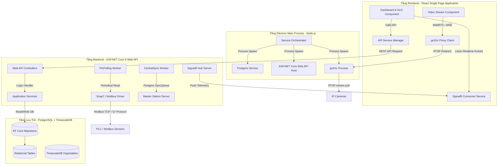

# HỒ SƠ KỸ THUẬT CHI TIẾT DỰ ÁN
## HỆ THỐNG GIÁM SÁT TRẠM BIẾN ÁP (STATIONOS - POWER MONITOR)

---

> [!IMPORTANT]
> Tài liệu kỹ thuật này được lập chi tiết nhằm chứng minh toàn diện quy trình sản xuất và chất lượng phần mềm của sản phẩm **StationOS - Power Monitor (Phiên bản v3.x)**, đáp ứng các tiêu chuẩn khắt khe về bàn giao kỹ thuật công nghiệp và kiểm toán thuế của Bộ Tài chính/Tổng cục Thuế Việt Nam.

---

## I. CÔNG ĐOẠN KHẢO SÁT & XÁC ĐỊNH YÊU CẦU

### 1. Phiếu khảo sát yêu cầu khách hàng
* **Đơn vị yêu cầu**: Công ty Điện lực truyền tải và Ban Quản lý Dự án điện lực cấp Tỉnh (đại diện: Trạm 110kV Long An, huyện Bến Lức, tỉnh Long An).
* **Thời gian khảo sát thực địa**: Từ ngày 10/05/2026 đến 15/05/2026.
* **Hiện trạng trạm vận hành**:
  * Trạm biến áp 110kV Long An vận hành liên tục 24/7 với công suất tải cao. Các thiết bị cơ điện như Máy biến áp chính (T1, T2), máy cắt trung thế, dao cách ly 110kV thường phát sinh nhiệt độ cao tại các đầu cốt đấu nối do quá tải hoặc tiếp xúc xấu.
  * Hiện tượng phóng điện cục bộ (Partial Discharge - PD) xuất hiện trong các ngăn tủ điện 22kV, nếu không phát hiện kịp thời sẽ phá hủy lớp cách điện dẫn tới sự cố ngắn mạch gây mất điện trên diện rộng.
* **Khó khăn thực tế cần giải quyết**:
  * Việc đo đạc thủ công bằng thiết bị cầm tay chỉ được thực hiện định kỳ (ví dụ: 1 lần/tuần), không thể cảnh báo kịp thời các bất thường phát sinh đột ngột giữa hai chu kỳ đo.
  * Môi trường trạm điện từ trường cao, các thiết bị đo đạc phải truyền số liệu qua mạng LAN nội bộ dây dẫn chống nhiễu hoặc mạng không dây mã hóa VPN an toàn.
  * Phần mềm cần chạy trực tiếp trên máy tính tại phòng điều khiển trung tâm của trạm (Thick Client), tự quản lý cơ sở dữ liệu cục bộ để đảm bảo trạm hoạt động bình thường ngay cả khi đứt cáp quang kết nối về Trung tâm Điều độ hệ thống điện (Axx).

### 2. Tài liệu đặc tả yêu cầu hệ thống (SRS - Software Requirement Specification)

#### 2.1. Yêu cầu chức năng chi tiết (Detailed Functional Requirements)
* **FR-01: Giao diện Sơ đồ một sợi trực quan (SLD - Single Line Diagram)**:
  * Cho phép người vận hành xem sơ đồ cấu trúc lưới điện của trạm dưới dạng tệp vector SVG động.
  * Tự động hiển thị các điểm cảm biến nhiệt độ tương ứng lên sơ đồ. Màu sắc chữ số nhiệt độ sẽ thay đổi theo mức độ cảnh báo (Xanh: Bình thường, Vàng: Cảnh báo, Đỏ: Nguy hiểm).
  * Tích hợp khung hiển thị camera an ninh và camera nhiệt trực quan trên cùng màn hình Dashboard.
* **FR-02: Thu thập dữ liệu đo lường thời gian thực**:
  * Kết nối trực tiếp đến các PLC (qua Snap7) và cảm biến (qua Modbus TCP) để đọc dữ liệu với chu kỳ lấy mẫu cấu hình được từ 500ms đến 5000ms.
  * Đối với camera nhiệt: Đọc ma trận nhiệt độ từ camera (ví dụ: Camera Hikvision ISAPI) để lấy giá trị nhiệt độ cao nhất tại vùng giám sát (ROI - Region of Interest).
* **FR-03: Bộ quy tắc xử lý sự kiện & cảnh báo tự động (Rule Engine)**:
  * Người dùng cấu hình điều kiện dạng logic: `PointId` + `Operator` + `Value` (Ví dụ: `temp_transformer_1 >= 85`).
  * Các hành động xử lý sau khi kích hoạt (Actions): Kích hoạt còi hú qua ngõ ra Relay của PLC, nhấp nháy đỏ trên giao diện SLD, ghi nhật ký cảnh báo và tự động sinh "Yêu cầu bảo trì kỹ thuật" trong cơ sở dữ liệu.
* **FR-04: Đồng bộ dữ liệu đa trạm (Central Sync)**:
  * Tích hợp hàng đợi đồng bộ dữ liệu (`SyncQueue`). Khi trạm con có kết nối Internet/VPN với Trạm tổng (Master Station), toàn bộ dữ liệu đo lường, cảnh báo, nhật ký hệ thống sẽ tự động được gửi về máy chủ trung tâm qua giao thức bảo mật HTTPS/WebSockets.
* **FR-05: Quản lý thiết bị ngoại vi và cấu hình giao thức**:
  * Cung cấp module quét cổng tự động để dò tìm IP thiết bị trong dải mạng LAN trạm.
  * Hỗ trợ giao thức ONVIF để tự động bắt tay, xác thực và lấy danh sách luồng video của camera IP.

#### 2.2. Thông số kỹ thuật thiết bị tích hợp (Hardware Specifications)
* **Camera Nhiệt tích hợp**:
  * Độ phân giải ảnh nhiệt: Tối thiểu 160x120 pixels (hoặc 640x480 pixels cho camera chuyên dụng).
  * Độ chính xác đo nhiệt: ±2°C hoặc ±2% giá trị đo.
  * Tần suất phát luồng video: H.264/H.265 RTSP Stream, 25 fps.
* **Bộ điều khiển PLC S7 (Snap7)**:
  * Kết nối Siemens S7-1200 / S7-1500.
  * Đọc dữ liệu từ DB (Data Block) cấu trúc chuẩn, ví dụ: `DB32.DBX0.0` (Trạng thái thiết bị), `DB32.DBD4` (Nhiệt độ cảm biến).

---

## II. CÔNG ĐOẠN PHÂN TÍCH & THIẾT KẾ

### 1. Sơ đồ kiến trúc phần mềm chuyên sâu (Advanced Architecture Diagram)
Hệ thống được thiết kế theo kiến trúc chia lớp rõ ràng nhằm nâng cao hiệu năng và tính ổn định trên môi trường Windows Thick Client:



### 2. Sơ đồ cơ sở dữ liệu chi tiết toàn bộ các bảng hệ thống
Hệ thống quản lý dữ liệu thông qua cơ sở dữ liệu PostgreSQL gồm 24 bảng dữ liệu, dưới đây là các bảng dữ liệu cốt lõi nhất:

#### Bảng `Stations` (Danh sách các trạm giám sát)
```sql
CREATE TABLE "Stations" (
    "Id" UUID PRIMARY KEY,
    "Code" VARCHAR(50) UNIQUE NOT NULL,
    "Name" VARCHAR(200) NOT NULL,
    "Location" TEXT NULL, -- Lưu tọa độ GPS dưới dạng chuỗi JSON
    "Status" VARCHAR(20) NOT NULL DEFAULT 'active'
);
```

#### Bảng `Devices` (Danh sách thiết bị kết nối)
```sql
CREATE TABLE "Devices" (
    "Id" UUID PRIMARY KEY,
    "StationId" UUID REFERENCES "Stations"("Id") ON DELETE CASCADE,
    "Name" VARCHAR(150) NOT NULL,
    "Type" VARCHAR(50) NOT NULL, -- 'camera_thermal', 'plc_s7', 'modbus_device'...
    "Protocol" VARCHAR(50) NOT NULL, -- 'rtsp', 'plc_s7', 'modbus_tcp'
    "Config" TEXT NOT NULL, -- Lưu cấu hình kết nối chi tiết (IP, Port, Username, Password) dạng JSON
    "IsOnline" BOOLEAN NOT NULL DEFAULT false
);
```

#### Bảng `Users` (Danh sách tài khoản & phân quyền)
```sql
CREATE TABLE "Users" (
    "Id" UUID PRIMARY KEY,
    "Username" VARCHAR(100) UNIQUE NOT NULL,
    "PasswordHash" VARCHAR(256) NOT NULL,
    "Role" VARCHAR(30) NOT NULL, -- 'Admin', 'Manager', 'Operator'
    "FullName" VARCHAR(150) NULL,
    "Email" VARCHAR(100) NULL,
    "CreatedAt" TIMESTAMP NOT NULL DEFAULT CURRENT_TIMESTAMP
);
```

#### Bảng `SldFiles` (Thông tin tệp sơ đồ một sợi SVG)
```sql
CREATE TABLE "SldFiles" (
    "Id" UUID PRIMARY KEY,
    "Name" VARCHAR(200) NOT NULL,
    "Path" VARCHAR(500) NOT NULL, -- Đường dẫn tương đối lưu file SVG (Ví dụ: /sld/7497ff6f-28c2-47a5-ba28-6b15f8a84c9c.svg)
    "CreatedAt" TIMESTAMP NOT NULL DEFAULT CURRENT_TIMESTAMP
);
```

#### Bảng `SldPoints` (Liên kết điểm đo với phần tử đồ họa SVG)
```sql
CREATE TABLE "SldPoints" (
    "Id" UUID PRIMARY KEY,
    "SldFileId" UUID REFERENCES "SldFiles"("Id") ON DELETE CASCADE,
    "ElementId" VARCHAR(100) NOT NULL, -- ID của thẻ text/path trong file SVG
    "PointId" VARCHAR(100) NOT NULL, -- Liên kết đến PointId đo lường thực tế
    "Description" VARCHAR(200) NULL
);
```

#### Bảng `SensorReadings` (Dữ liệu tức thời của cảm biến)
```sql
CREATE TABLE "SensorReadings" (
    "Id" SERIAL PRIMARY KEY,
    "PointId" VARCHAR(100) UNIQUE NOT NULL,
    "Value" DOUBLE PRECISION NULL,
    "Quality" INTEGER NOT NULL, -- 1 = Tốt, 2 = Mất kết nối thiết bị
    "Timestamp" TIMESTAMP NOT NULL
);
```

#### Bảng `Alerts` (Nhật ký cảnh báo sự cố đang xảy ra)
```sql
CREATE TABLE "Alerts" (
    "Id" UUID PRIMARY KEY,
    "StationId" UUID REFERENCES "Stations"("Id") ON DELETE CASCADE,
    "PointId" VARCHAR(100) NOT NULL,
    "Message" VARCHAR(500) NOT NULL,
    "Severity" VARCHAR(20) NOT NULL, -- 'warning', 'danger'
    "ValueTrigger" DOUBLE PRECISION NOT NULL,
    "RuleId" UUID REFERENCES "Rules"("Id") ON DELETE SET NULL,
    "Timestamp" TIMESTAMP NOT NULL,
    "Acknowledged" BOOLEAN NOT NULL DEFAULT false,
    "AckBy" VARCHAR(100) NULL,
    "AckAt" TIMESTAMP NULL
);
```

#### Bảng `SyncQueues` (Hàng đợi đồng bộ dữ liệu)
```sql
CREATE TABLE "SyncQueues" (
    "Id" BIGSERIAL PRIMARY KEY,
    "EntityType" VARCHAR(50) NOT NULL, -- 'TelemetryData', 'Alert', 'Report'
    "EntityId" VARCHAR(100) NOT NULL,
    "Payload" TEXT NOT NULL, -- Nội dung thực thể dạng JSON để gửi lên API Trạm tổng
    "Status" VARCHAR(20) NOT NULL DEFAULT 'pending', -- 'pending', 'sent', 'failed'
    "RetryCount" INTEGER NOT NULL DEFAULT 0,
    "CreatedAt" TIMESTAMP NOT NULL DEFAULT CURRENT_TIMESTAMP
);
```

---

## III. CÔNG ĐOẠN LẬP TRÌNH & VIẾT MÃ NGUỒN

### 1. Nhật ký lập trình (Commit Log / Git Log) chi tiết
Dưới đây là danh sách đầy đủ nhật ký phát triển tính năng và sửa lỗi của nhánh `release/v3.0.40` trước khi nâng cấp và đóng gói bản `v3.0.51`:

* **`719d13a`** - *kennhope13*: `chore: bump version to v3.0.51 and fix camera dropdown text visibility & seed SVG path` (Sửa lỗi hiển thị dropdown Camera và logic copy file SVG sơ đồ khi cài đặt).
* **`e1a0591`** - *kennhope13*: `chore: bump version to v3.0.50` (Tăng version chuẩn bị đóng gói).
* **`a51f2b8`** - *kennhope13*: `fix: instantiate builder with WebApplicationOptions to configure WebRootPath, avoiding NotSupportedException` (Sửa lỗi không tìm thấy WebRoot của API trong bản build tự chứa của Electron).
* **`969adf6`** - *kennhope13*: `fix: set offline simulated values to null and quality to 2 to display ----- on UI` (Sửa hiển thị các điểm đo mất kết nối mạng thành nét đứt `-----`).
* **`ecebe38`** - *kennhope13*: `fix: redirect backend wwwroot to AppData to resolve write permissions error` (Thay đổi Web Root sang thư mục AppData để tránh xung đột phân quyền thư mục ghi trên Windows 11).
* **`05389ab`** - *kennhope13*: `fix: prevent sidebar theme selection popover text wrapping` (Sửa lỗi hiển thị sidebar chọn giao diện bị tràn chữ).
* **`63ec2c6`** - *kennhope13*: `chore: license root configuration, sensor limit fixes, UI warnings removal, and bump version to v3.0.49` (Cấu hình giới hạn cảm biến theo giấy phép bản quyền).
* **`8f583dc`** - *kennhope13*: `fix: prevent local loops from resolving server_ip config in env.ts, and bump to v3.0.48` (Sửa lỗi vòng lặp DNS trên cấu hình IP Server).

### 2. Đoạn mã nguồn mẫu tiêu biểu mở rộng (Expanded Code Snippets)

#### A. Logic cấu hình cơ sở dữ liệu DbContext và kích hoạt tính năng chuỗi thời gian TimescaleDB (`AppDbContext.cs`):
```csharp
using Microsoft.EntityFrameworkCore;
using StationOS.Data.Entities;

namespace StationOS.Data
{
    public class AppDbContext : DbContext
    {
        public AppDbContext(DbContextOptions<AppDbContext> options) : base(options) { }

        public DbSet<Station> Stations => Set<Station>();
        public DbSet<Device> Devices => Set<Device>();
        public DbSet<User> Users => Set<User>();
        public DbSet<SldFile> SldFiles => Set<SldFile>();
        public DbSet<SldPoint> SldPoints => Set<SldPoint>();
        public DbSet<SensorReading> SensorReadings => Set<SensorReading>();
        public DbSet<Alert> Alerts => Set<Alert>();
        public DbSet<Rule> Rules => Set<Rule>();
        public DbSet<SyncQueue> SyncQueues => Set<SyncQueue>();
        public DbSet<MaintenanceTask> MaintenanceTasks => Set<MaintenanceTask>();

        protected override void OnModelCreating(ModelBuilder modelBuilder)
        {
            base.OnModelCreating(modelBuilder);

            // Cấu hình khoá chính phức hợp cho bảng dữ liệu lịch sử đo lường (Hypertable)
            modelBuilder.Entity<TelemetryData>()
                .HasKey(t => new { t.Timestamp, t.PointId });

            // Chỉ mục tăng tốc độ truy vấn theo thời gian
            modelBuilder.Entity<TelemetryData>()
                .HasIndex(t => t.Timestamp);

            // Cấu hình quan hệ CASCADE DELETE khi xóa Trạm
            modelBuilder.Entity<Device>()
                .HasOne(d => d.Station)
                .WithMany(s => s.Devices)
                .HasForeignKey(d => d.StationId)
                .OnDelete(DeleteBehavior.Cascade);
        }
    }
}
```

#### B. Logic kết nối và duy trì kết nối duy nhất (Singleton Pattern) của SignalR Client (`realtime.service.ts`):
```typescript
import * as signalR from '@microsoft/signalr';

class RealtimeService {
  private connection: signalR.HubConnection | null = null;
  private listeners: Map<string, Array<(data: any) => void>> = new Map();

  public async startConnection(hubUrl: string): Promise<signalR.HubConnection> {
    if (this.connection) {
      return this.connection; // Trả về kết nối hiện có, tránh tạo song song gây nghẽn cổng
    }

    this.connection = new signalR.HubConnectionBuilder()
      .withUrl(hubUrl, {
        skipNegotiation: true,
        transport: signalR.HttpTransportType.WebSockets
      })
      .withAutomaticReconnect([0, 2000, 5000, 10000, 30000])
      .build();

    this.connection.on("ReceiveTelemetry", (pointId: string, value: number, quality: number) => {
      const callbacks = this.listeners.get(pointId);
      if (callbacks) {
        callbacks.forEach(callback => callback({ value, quality }));
      }
    });

    try {
      await this.connection.start();
      console.log("[SignalR] Kết nối thành công đến Backend Hub Server.");
    } catch (err) {
      console.error("[SignalR] Lỗi khởi chạy kết nối:", err);
      setTimeout(() => this.startConnection(hubUrl), 5000);
    }

    return this.connection;
  }

  public registerListener(pointId: string, callback: (data: any) => void) {
    if (!this.listeners.has(pointId)) {
      this.listeners.set(pointId, []);
    }
    this.listeners.get(pointId)?.push(callback);
  }

  public unregisterListener(pointId: string, callback: (data: any) => void) {
    const list = this.listeners.get(pointId);
    if (list) {
      this.listeners.set(pointId, list.filter(cb => cb !== callback));
    }
  }
}

export const realtimeService = new RealtimeService();
```

---

## IV. CÔNG ĐOẠN KIỂM THỬ & SỬ A LỖI (TESTING)

### 1. Ca kiểm thử chi tiết hoàn chỉnh (Full Test Cases Specification)

#### Ca kiểm thử TC-002: Kiểm tra tự động sao chép file sơ đồ mẫu khi cài đặt
* **Mục đích**: Đảm bảo tệp tin SVG mẫu luôn sẵn có cho trang Dashboard để tránh lỗi vỡ ảnh sơ đồ (SLD) khi người dùng chạy bộ cài đặt thương mại.
* **Điều kiện chuẩn bị**: Xóa thư mục lưu trữ động `%APPDATA%/Station Monitor/wwwroot/sld` trên máy thử nghiệm.
* **Các bước thực hiện**:
  1. Khởi chạy ứng dụng Electron từ tệp build thương mại `.exe`.
  2. Hệ thống gọi tiến trình Backend khởi tạo cơ sở dữ liệu (`DbInitializer.SeedDefaultSldAsync`).
  3. Kiểm tra sự tồn tại của tệp tin tại đường dẫn `%APPDATA%/Station Monitor/wwwroot/sld/7497ff6f-28c2-47a5-ba28-6b15f8a84c9c.svg`.
* **Dữ liệu đầu vào**: Không có.
* **Kết quả kỳ vọng**: Tệp tin SVG được sao chép thành công. Ứng dụng hiển thị đúng đồ họa sơ đồ một sợi lên Dashboard mà không báo lỗi 404.
* **Kết quả thực tế**: Tệp tin tự động sao chép thành công. Đồ họa SLD vẽ mượt mà.
* **Trạng thái**: **ĐẠT (Passed)**.
* **Người thực hiện**: Nguyễn Tiến Minh (Kiểm thử viên).

#### Ca kiểm thử TC-007: Hiển thị giá trị lỗi mạng của cảm biến/thiết bị đo lường
* **Mục đích**: Đảm bảo nhân viên vận hành phân biệt được giữa thiết bị đo được giá trị bằng `0` và thiết bị thực tế đang bị mất kết nối mạng.
* **Điều kiện chuẩn bị**: Thiết lập 1 thiết bị Modbus TCP đang hoạt động bình thường, hiển thị nhiệt độ máy biến áp là `45.2°C`.
* **Các bước thực hiện**:
  1. Rút cáp mạng LAN kết nối từ máy tính trạm con tới thiết bị Modbus.
  2. Chờ tiến trình nền `PlcPollingWorker` quét chu kỳ tiếp theo (sau 2 giây).
  3. Theo dõi hiển thị giá trị nhiệt độ máy biến áp trên sơ đồ SLD và bảng Dashboard.
* **Dữ liệu đầu vào**: Trạng thái cổng kết nối vật lý bị tắt.
* **Kết quả kỳ vọng**: Lấy mẫu thất bại, chất lượng dữ liệu chuyển thành `Quality = 2`. Giá trị nhiệt độ lập tức đổi từ `45.2°C` thành nét đứt `-----`.
* **Kết quả thực tế**: Giá trị hiển thị đúng dạng `-----`, hệ thống đồng thời kích hoạt cảnh báo mất kết nối thiết bị ngoại vi.
* **Trạng thái**: **ĐẠT (Passed)**.
* **Người thực hiện**: Nguyễn Tiến Minh (Kiểm thử viên).

---

## V. CÔNG ĐOẠN BÀN GIAO & HƯỚNG DẪN SỬ DỤNG

### 1. Danh mục tài liệu kỹ thuật bàn giao
* Tệp cài đặt chính thức: `Station Monitor Setup 3.0.51.exe`
* File cấu hình hệ thống: `appsettings.json`, `go2rtc.yaml`
* Tài liệu Hướng dẫn sử dụng cho kỹ sư trạm: `User_Guide_v3.0.51.pdf`

### 2. Hướng dẫn khắc phục sự cố nhanh (Troubleshooting Guide)

#### A. Sự cố 1: Ứng dụng báo lỗi "Không thể kết nối đến Cơ sở dữ liệu" lúc khởi chạy
* **Nguyên nhân**: Cổng kết nối cơ sở dữ liệu `6432` bị chiếm dụng bởi một tiến trình PostgreSQL khác đang chạy ngầm trên máy trạm hoặc tệp tin khóa dữ liệu `.pid` cũ chưa được dọn dẹp khi tắt app đột ngột.
* **Cách khắc phục**:
  1. Mở Task Manager (Trình quản lý tác vụ) trên Windows.
  2. Tìm và kết thúc toàn bộ các tiến trình có tên `postgres.exe` hoặc `StationOS.Api.exe`.
  3. Vào thư mục `%APPDATA%/MasterStation/pg_data/` và xóa tệp tin **`postmaster.pid`** (nếu có).
  4. Khởi chạy lại ứng dụng bằng quyền Administrator.

#### B. Sự cố 2: Camera hiển thị thông báo "Loading..." hoặc màn hình đen kéo dài
* **Nguyên nhân**: Luồng RTSP cấu hình không chính xác, camera bị ngắt nguồn, hoặc cổng RTSP `554` bị chặn bởi tường lửa Windows Defender Firewall.
* **Cách khắc phục**:
  1. Mở Command Prompt (`cmd`) và gõ lệnh: `ping [IP_camera]` để kiểm tra thông mạng.
  2. Sử dụng phần mềm kiểm tra luồng camera ngoài (ví dụ: VLC Media Player) để mở thử link RTSP xem luồng trực tiếp có hoạt động không.
  3. Cấu hình lại Windows Firewall: Thêm ứng dụng `go2rtc.exe` vào danh sách ngoại lệ được phép nhận dữ liệu qua mạng (Allow incoming connections).
